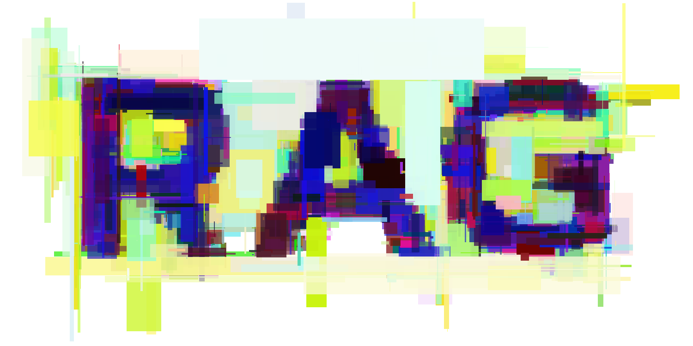

<div align="center">

# Random Art Generator


</div>

Random Art Generator is a command-line application to produce generative art.

When passed a _target_ image, it will start painting on a blank canvas, essentially creating new images at random. Resulting images that are _mathematically closer_ to the target image are kept, and used as a new canvas; results that aren't get discarded. This repeats until the desired number of attempts or generations is achieved.

Technically known as [hill climbing](https://en.wikipedia.org/wiki/Hill_climbing), this process allows the creation of new images that progressively converge into the target image, with a style all its own.

This application is written in [Rust](https://www.rust-lang.org/). Currently, only the source code is provided, as no downloadable and executable binaries are created. This will likely change in the future, as both macOS/Windows/Linux applications and Webasm targets are planned.

## Run

Since the application is provided as source code, it need to be compiled and ran by [Cargo](https://doc.rust-lang.org/cargo/getting-started/installation.html).

Basic example with general parameters:

```shell
cargo run -- target.jpg [--input input.jpg] [--output output.png] --attempts 10 --generations 10 [--background-color ff0022] [--scale 2.0] [--painter rects|circles] [--painter-alpha 0.1-0.2 1.0]
```

Circles painter example with specific parameters:

```shell
cargo run -- target.jpg --generations 10 --painter circles [--painter-alpha 0.1-0.2 1.0] [--painter-radius 0.0-0.5] [--painter-radius-bias -3]
```

Command line switches are still being added. For a full list of the currently available switches and a brief explanation, run:

```shell
cargo run -- --help
```

Or check [the struct source code](https://github.com/zeh/art-generator/blob/master/src/main.rs#L15).

## Create release binary

A self-compiled release binary can be created with Cargo as well:

```shell
cargo build --release
```

## License

[MIT](LICENSE).
