# Running Random Art Generator

## Introduction

Random Art Generator is a command-line application. As such, it is called from a terminal, with several arguments or flags passed to it.

The general format for running RAG is as follow:

```shell
rag target-file-image [FLAGS] [OPTIONS]
```

For example:

```shell
rag profile.jpg --generations 100
```

Or using the `circles` painter with specific parameters for illustration:

```shell
rag target.jpg --generations 10 --output mypic.png --background-color ff0022 --painter circles --painter-alpha 0.1-0.2 1.0 --painter-radius 1-100 --painter-radius-bias -3 --margins 10% --color-seed 0.9
```

Running with a single `-h` or `--help` argument will show you all arguments available, and a brief or semi-brief explanation of each, respectively:

```shell
rag -h
```

## All flags/options

RAG was developed with a liberal approach to arguments: anything that make sense to be controlled via arguments, and is not too redundant with editing that could be manually performed using an external application like Photoshop, is added as an argument. Therefore, the list of arguments is large (and growing), and some of them might admitedly sound a bit too specific.

A list of all arguments, with examples, follow. Examples are generated with an argument of `--rng-seed 1` (to make them easily reproducible), or with additional options to better expose differences between the result of each example, like variations of `--painter-alpha`.

For the purpose of examples, this documentation uses the [Mandrill](https://www.researchgate.net/figure/Original-standard-test-image-of-Mandrill-also-known-as-Baboon_fig9_259521525) test image as a "target" image.

<p align="center">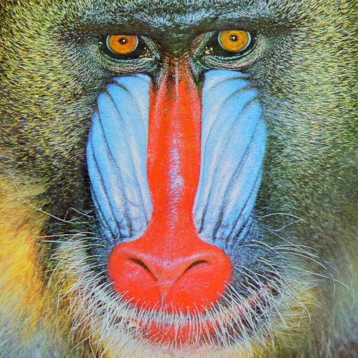</p>

### Index

- Flags/options
    - [`--background-color <color>`](#background-color)
    - [`--benchmark`](#benchmark)
    - [`--blending-mode <blending-mode>...`](#blending-mode)
    - [`-c`, `--candidates <integer>`](#candidates)
    - [`--color-seed <scale>`](#color-seed)
    - [`--diff <scale>`](#diff)
    - [`-g`, `--generations <integer>`](#generations)
    - [`-h`, `--help`](#help)
    - [`-i`, `--input <filename>`](#input)
    - [`--low-power`](#low-power)
    - [`--margins <sizes>`](#margins)
    - [`--no-metadata`](#no-metadata)
    - [`-t`, `--max-tries <integer>`](#max-tries)
    - [`-o`, `--output <filename>`](#output)
    - [`-p`, `--painter <painter>`](#painter)
    - [`--painter-alpha <alpha>...`](#painter-alpha)
    - [`--painter-alpha-bias <bias>`](#painter-alpha-bias)
    - [`--painter-disable-anti-alias`](#painter-disable-anti-alias)
    - [`--painter-height <size>...`](#painter-height)
    - [`--painter-height-bias <bias>`](#painter-height-bias)
    - [`--painter-radius <size>...`](#painter-radius)
    - [`--painter-radius-bias <bias>`](#painter-radius-bias)
    - [`--painter-rotation <float>...`](#painter-rotation)
    - [`--painter-wave-height <size>...`](#painter-wave-height)
    - [`--painter-wave-height-bias <bias>`](#painter-wave-height-bias)
    - [`--painter-wave-length <size>...`](#painter-wave-length)
    - [`--painter-wave-length-bias <bias>`](#painter-wave-length-bias)
    - [`--painter-width <size>...`](#painter-width)
    - [`--painter-width-bias <bias>`](#painter-width-bias)
    - [`--rng-seed <integer>`](#rng-seed)
    - [`-s`, `--scale <float>`](#scale)
    - [`--save-often`](#save-often)
    - [`--target-color-matrix <color-matrix>`](#target-color-matrix)
    - [`-v`, `--verbose`](#verbose)
    - [`--version`](#version)
- Data types
    - [Bias](#type-bias)
    - [Color](#type-color)
    - [Float](#type-float)
    - [Integer](#type-integer)
    - [List](#type-list)
    - [Range](#type-range)
    - [Scale](#type-scale)
    - [Size](#type-size)

### All flags/options

#### <a id="background-color"></a> `--background-color <color>`

Default: `000000`

Type: [Color](#type-color)

The color to be used as the default background for the new image.

| Example | Argument | Command line example | Result |
|-|-|-|-|
| Default (black) | N/A | `rag mandrill.png --generations 10 --rng-seed 1 --painter-alpha 0.5` | 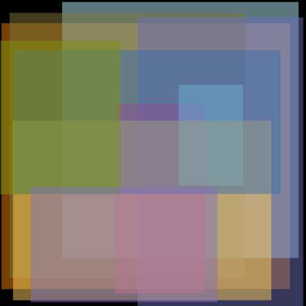 |
| Hex color | `--background-color ff00ff` | `rag mandrill.png --generations 10 --rng-seed 1 --painter-alpha 0.5 --background-color ff00ff` | 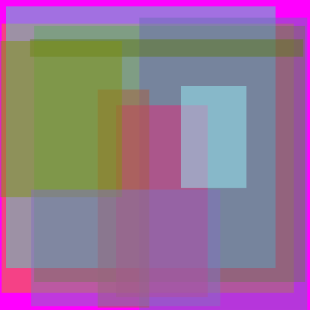 |
| Color name | `--background-color yellow` | `rag mandrill.png --generations 10 --rng-seed 1 --painter-alpha 0.5 --background-color yellow` | 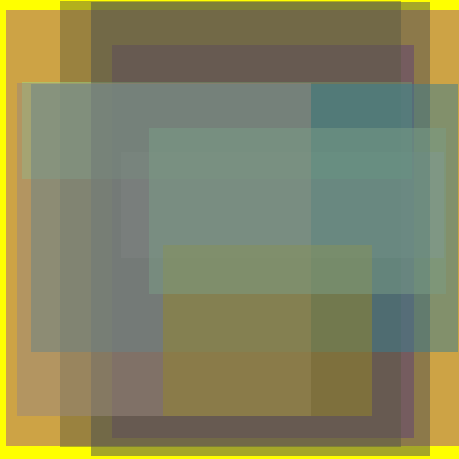 |

#### <a id="benchmark"></a> `--benchmark`

Outputs benchmark results.

With this flag, the application will gather some benchmark metrics and output them after it runs. This is useful to measure efficiency of the algorithm as it evolves.

It's recommended to use the same [`--candidates 1`](#candidates) and [`--rng-seed`](#rng-seed) value across different runs, for consistent results.

#### <a id="blending-mode"></a>`--blending-mode <blending-mode>...`

Default: `normal`

Type: Single string or [list](#type-list) of strings enumerated from `normal`, `multiply`, `screen`, `overlay`, `darken`, `lighten`, `color-dodge`, `color-burn`, `hard-light`, `soft-light`, `difference`, and `exclusion`

Blending mode(s) to be used when overlaying new candidates, either as a single entry, or as a list. The blending modes follow some of the classic Photoshop blending modes.

Use this option with caution. Some monotonic blending modes (`screen`, `multiply`, etc) might cause the image generation to never finish. For example, with a complete white base image, it's impossible for it to be altered further with the `screen` blending mode.

| Example | Argument | Command line example | Result |
|-|-|-|-|
| Default (Normal) | N/A | `rag mandrill.png --generations 100 --rng-seed 1 --painter-alpha 0.7 --background-color 906050` | 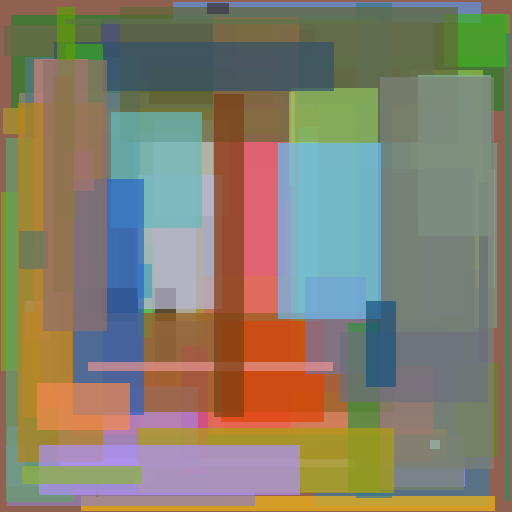 |
| Multiply | `--blending-mode multiply` | `rag mandrill.png --generations 100 --rng-seed 1 --painter-alpha 0.7 --background-color 906050 --blending-mode multiply` | 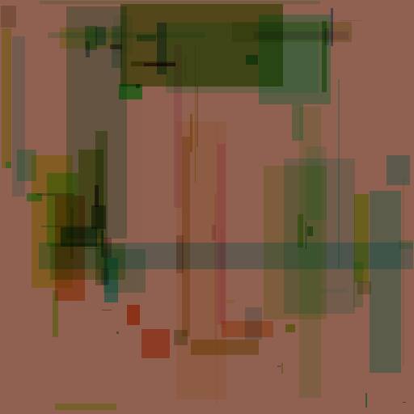 |
| Screen | `--blending-mode screen` | `rag mandrill.png --generations 100 --rng-seed 1 --painter-alpha 0.7 --background-color 906050 --blending-mode screen` | 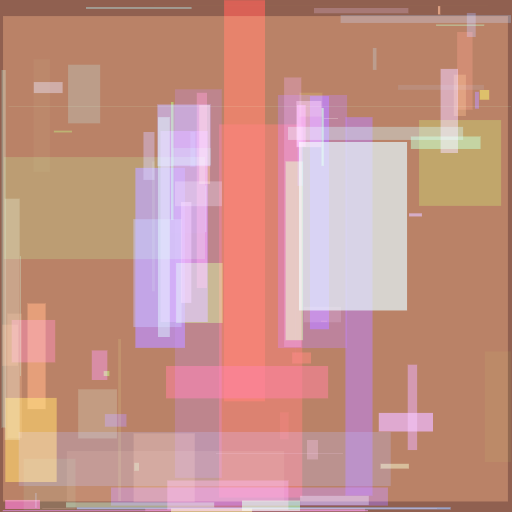 |
| Overlay | `--blending-mode overlay` | `rag mandrill.png --generations 100 --rng-seed 1 --painter-alpha 0.7 --background-color 906050 --blending-mode overlay` | 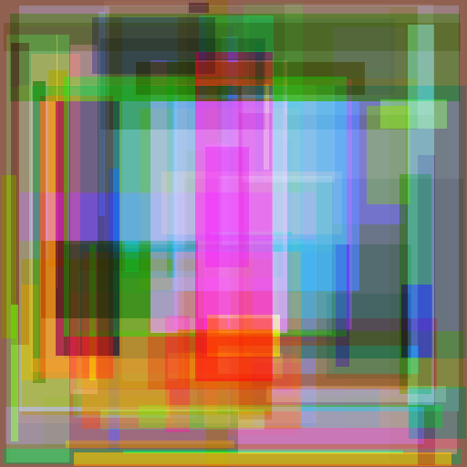 |
| Darken | `--blending-mode darken` | `rag mandrill.png --generations 100 --rng-seed 1 --painter-alpha 0.7 --background-color 906050 --blending-mode darken` | 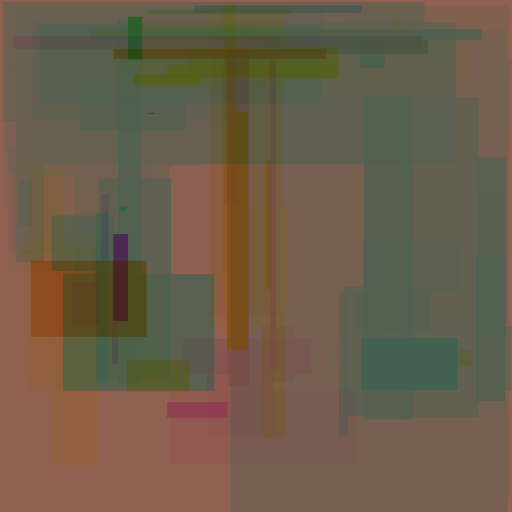 |
| Lighten | `--blending-mode lighten` | `rag mandrill.png --generations 100 --rng-seed 1 --painter-alpha 0.7 --background-color 906050 --blending-mode lighten` | 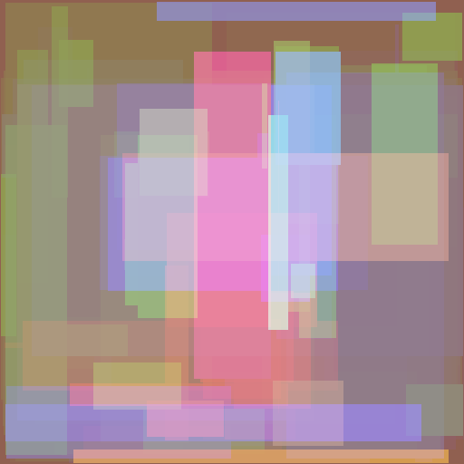 |
| Color Dodge | `--blending-mode color-dodge` | `rag mandrill.png --generations 100 --rng-seed 1 --painter-alpha 0.7 --background-color 906050 --blending-mode color-dodge` | 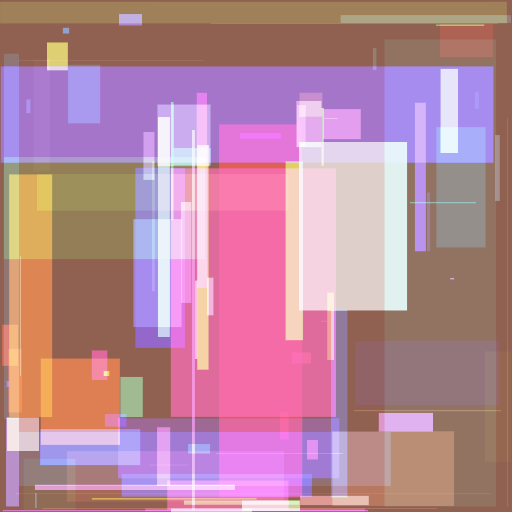 |
| Color Burn | `--blending-mode color-burn` | `rag mandrill.png --generations 100 --rng-seed 1 --painter-alpha 0.7 --background-color 906050 --blending-mode color-burn` | 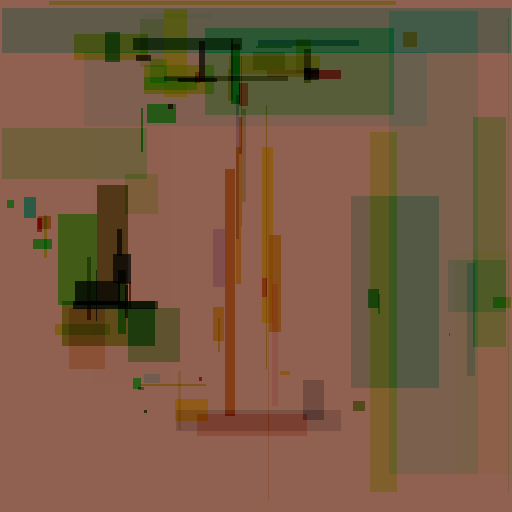 |
| Hard Light | `--blending-mode hard-light` | `rag mandrill.png --generations 100 --rng-seed 1 --painter-alpha 0.7 --background-color 906050 --blending-mode hard-light` | 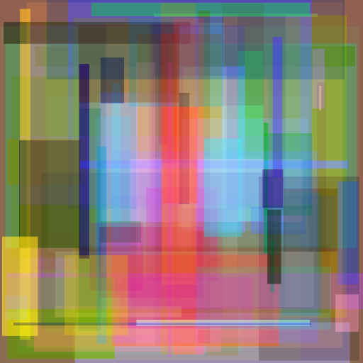 |
| Soft Light | `--blending-mode soft-light` | `rag mandrill.png --generations 100 --rng-seed 1 --painter-alpha 0.7 --background-color 906050 --blending-mode soft-light` | 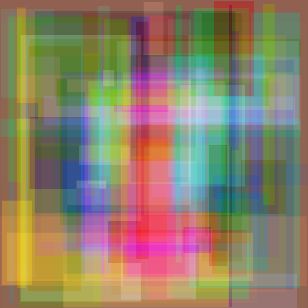 |
| Difference | `--blending-mode difference` | `rag mandrill.png --generations 100 --rng-seed 1 --painter-alpha 0.7 --background-color 906050 --blending-mode difference` | 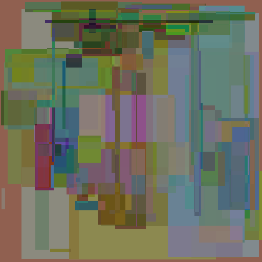 |
| Exclusion | `--blending-mode exclusion` | `rag mandrill.png --generations 100 --rng-seed 1 --painter-alpha 0.7 --background-color 906050 --blending-mode exclusion` | 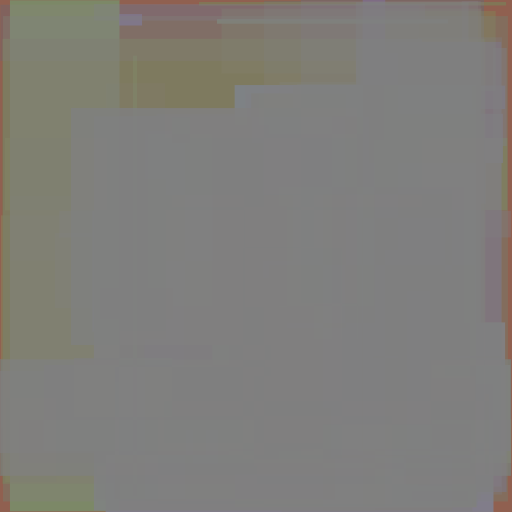 |
| Mixed (equal chance of "normal", "multiply", "color burn", and "darken") | `--blending-mode normal multiply color-burn darken` | `rag mandrill.png --generations 200 --rng-seed 1 --painter-alpha 0.9 --background-color white --blending-mode normal multiply color-burn darken` | 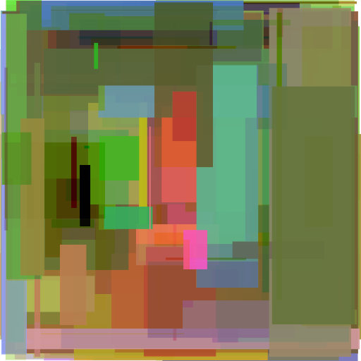 |
| Mixed (~5% chance of "normal", ~47% of "screen", ~47% chance of "color dodge") | `--blending-mode normal screen@10 color-dodge@10` | `rag mandrill.png --generations 200 --rng-seed 1 --painter-alpha 0.9 --blending-mode normal screen@10 color-dodge@10` | 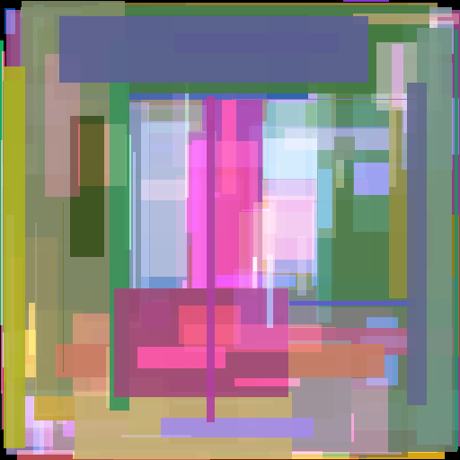 |

#### <a id="candidates"></a>`-c`, `--candidates <integer>`

Default: `0`

Type: [Integer](#type-integer)

Number of parallel image painting candidates per try.

In general, the higher the number of candidates, the better the resulting images with the same number of tries, at a cost of higher GPU memory usage.

| Example | Argument | Command line example | Result |
|-|-|-|-|
| 1 candidate per try | `--candidates 1` | `rag mandrill.png --generations 100 --rng-seed 1 --painter-alpha 0.5 --candidates 1` | 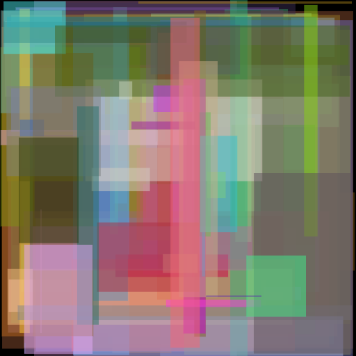 |
| 10 candidates per try | `--candidates 10` | `rag mandrill.png --generations 100 --rng-seed 1 --painter-alpha 0.5 --candidates 10` | 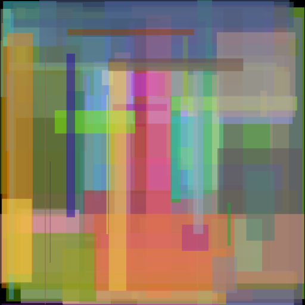 |
| 100 candidates per try | `--candidates 100` | `rag mandrill.png --generations 100 --rng-seed 1 --painter-alpha 0.5 --candidates 100` | 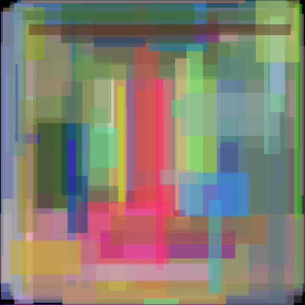 |

#### <a id="color-seed"></a>`-c`, `--color-seed <scale>`

Default: `0`

Type: [Scale](#type-scale)

Amount of color from the original target image to use as a "seed" when deciding on what color to use when painting a new candidate. With this set to `0`; the algorithm will try painting with a completely random new color; with this set to `1`, the algorithm will use the color already found in the target color; and everything in between is a blend of the two.

Using a higher color seed number causes the algorithm to generate valid candidates much faster, and thus create a new image that is closer to the target in shorter time. It does decrease the randomness of the output image, and could in some ways be seen as "cheating" as the algorithm isn't painting blindly anymore.

| Example | Argument | Command line example | Result |
|-|-|-|-|
| 0 (Default, no seed) | `--color-seed 0` | `rag mandrill.png --generations 20 --rng-seed 1 --painter-alpha 0.9 --color-seed 0` | 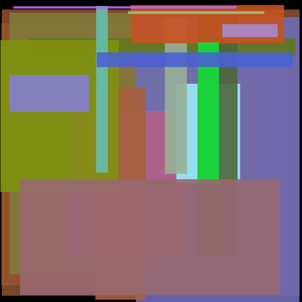 |
| 0.5 (half seed) | `--color-seed 0.5` | `rag mandrill.png --generations 20 --rng-seed 1 --painter-alpha 0.9 --color-seed 0.5` | 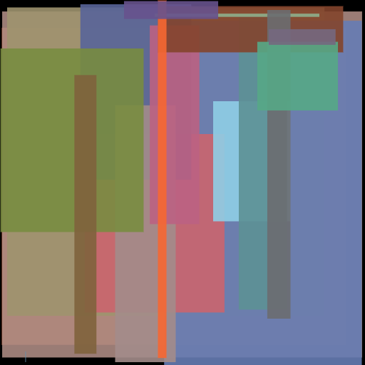 |
| 1 (full seed) | `--color-seed 1` | `rag mandrill.png --generations 20 --rng-seed 1 --painter-alpha 0.9 --color-seed 1` | 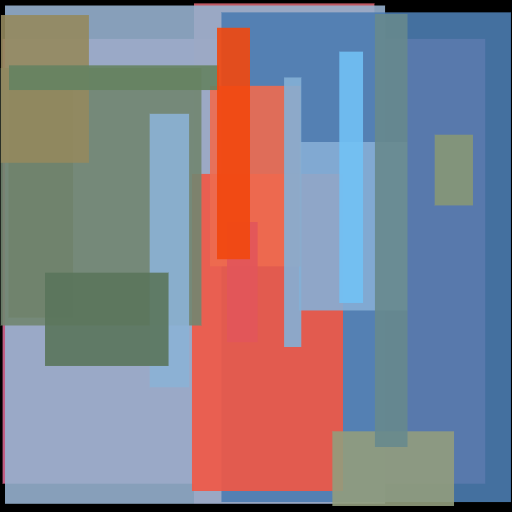 |

#### <a id="diff"></a>`--diff <scale>`

Default: `0`

Type: [Scale](#type-scale)

Expected difference score to reach, indicating the desired difference from the new generated image to the target image. New candidates are generated continuously until the resulting difference is below this threshold.

On each successfull image generation, the new diff value is generated by calculating the color difference of every pixel. For example, for a completely white target image, a completely black image has 100% difference, while a gray image would have 50% difference.

Be aware that the lower the target difference, the longer the time taken for full generation, sometimes exponentially so. Very low diff numbers (e.g. 10% and lower) might be virtually impossible to reach, or take an unordinate amount of time.

| Example | Argument | Command line example | Result |
|-|-|-|-|
| 30% target diff | `--diff 0.3` | `rag mandrill.png --rng-seed 1 --painter-alpha 0.8 --painter circles --color-seed 0.7 --diff 0.3` | 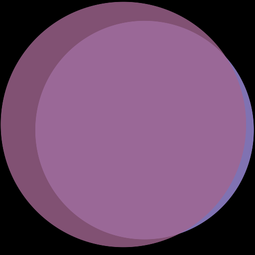 |
| 25% target diff | `--diff 0.25` | `rag mandrill.png --rng-seed 1 --painter-alpha 0.8 --painter circles --color-seed 0.7 --diff 0.25` | 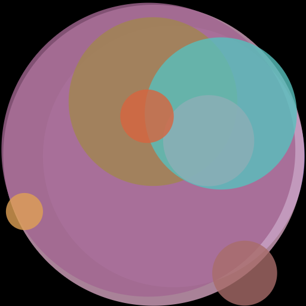 |
| 20% target diff | `--diff 0.2` | `rag mandrill.png --rng-seed 1 --painter-alpha 0.8 --painter circles --color-seed 0.7 --diff 0.2` | 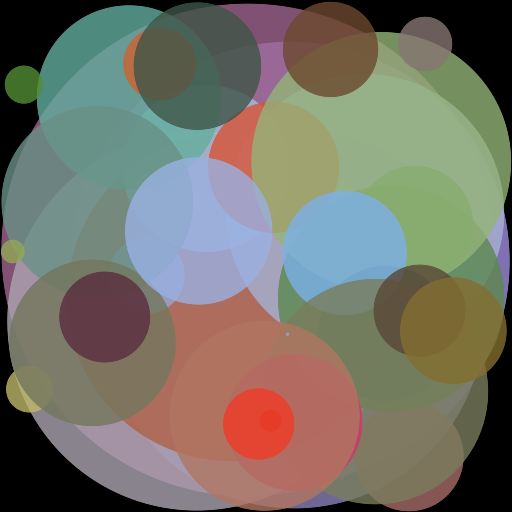 |
| 15% target diff | `--diff 0.15` | `rag mandrill.png --rng-seed 1 --painter-alpha 0.8 --painter circles --color-seed 0.7 --diff 0.15` | 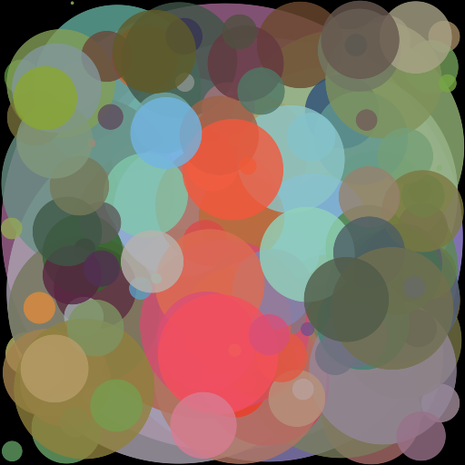 |
| 10% target diff | `--diff 0.1` | `rag mandrill.png --rng-seed 1 --painter-alpha 0.8 --painter circles --color-seed 0.7 --diff 0.10` | 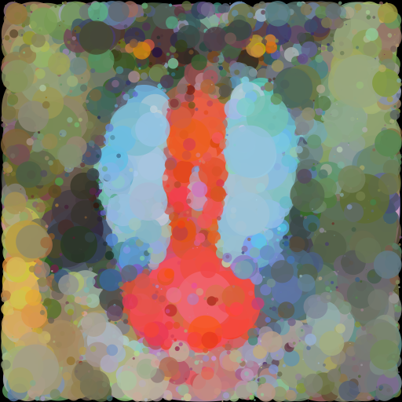 |

#### <a id="generations"></a>`-g`, `--generations <integer>`

Default: `0`

Type: [Integer](#type-integer)

Number of successful generations desired.

This is equivalent to the number of times the result image is expected to be successfully painted. In general, the higher the number of generations, the closer the image will be to the target image.

Set to `0` if no limit is desired.

| Example | Argument | Command line example | Result |
|-|-|-|-|
| 10 generations | `--generations 10` | `rag mandrill.png --rng-seed 1 --painter-alpha 0.9 --painter-width 5% --background-color white --margins 10% --generations 10` | 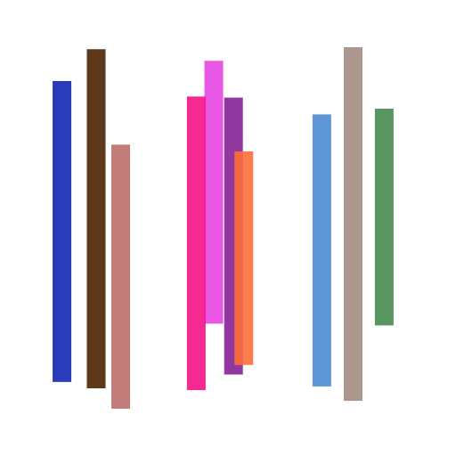 |
| 25 generations | `--generations 25` | `rag mandrill.png --rng-seed 1 --painter-alpha 0.9 --painter-width 5% --background-color white --margins 10% --generations 25` |  |
| 50 generations | `--generations 50` | `rag mandrill.png --rng-seed 1 --painter-alpha 0.9 --painter-width 5% --background-color white --margins 10% --generations 50` | 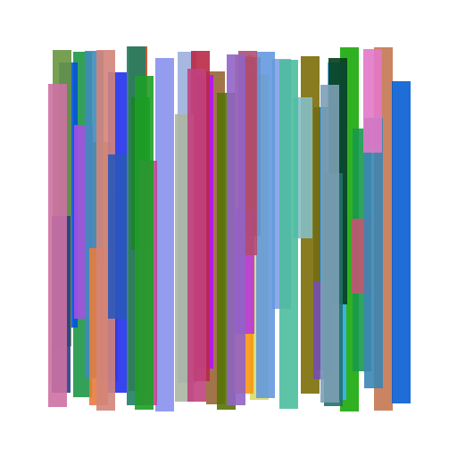 |
| 100 generations | `--generations 100` | `rag mandrill.png --rng-seed 1 --painter-alpha 0.9 --painter-width 5% --background-color white --margins 10% --generations 100` | 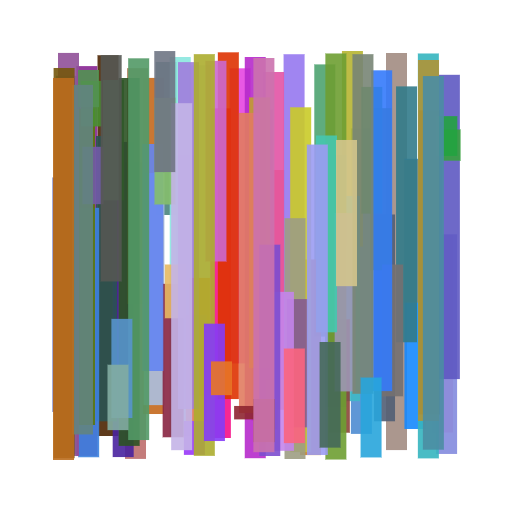 |
| 250 generations | `--generations 250` | `rag mandrill.png --rng-seed 1 --painter-alpha 0.9 --painter-width 5% --background-color white --margins 10% --generations 250` | 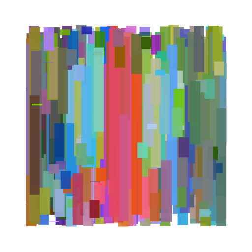 |

#### <a id="help"></a>`-h`, `--help`

Displays this help in text form. Use `-h` for a short output, and `--help` for longer explanations.

#### <a id="input"></a>`-i`, `--input <filename>`

Type: File path or name string

The filename for an input image, if any.

When present, the input image that serves as the starting image before anything is painted atop it. The [`--background-color`](#background-color) parameter is also ignored.

#### <a id="low-power"></a>`--low-power`

Instructs the application to use low power mode where appropriate.

When this flag is set, the application decides to use low power more rather than the default of high performance mode whenever possible. This is likely to make generation slower.

In practice, this has an effect when selecting which GPU card will be used to paint images in multi-GPU systems. In the default configuration, the most high-performance card (likely a "discrete" card) will be used; in low power mode, the best low-power card (likely an "integrated" card) is used instead.

#### <a id="margins"></a>`-c`, `--margins <sizes>`

Default: `0`

Type: [Size](#type-size) as one of `all`, or entries of `vertical,horizontal`, `top,horizontal,bottom`, or `top,right,bottom,left`

Set the margins for the output image.

This can either be a single size for all margins, or a comma-separated list of 2..4 items denoting the margins for each specific side (similar to [how margins are written in CSS](https://developer.mozilla.org/en-US/docs/Web/CSS/margin)).

When a percentage unit is used, they refer to the maximum width or height of the image. Values higher than the image size (in pixels or in percentages higher than `100%`) are allowed, in which case they cause the paint algorithm to bleed out of the image space.

| Example | Argument | Command line example | Result |
|-|-|-|-|
| Default, no margin | N/A | `rag mandrill.png --rng-seed 1 --painter-alpha 0.5 --painter circles --background-color beige --generations 100` | 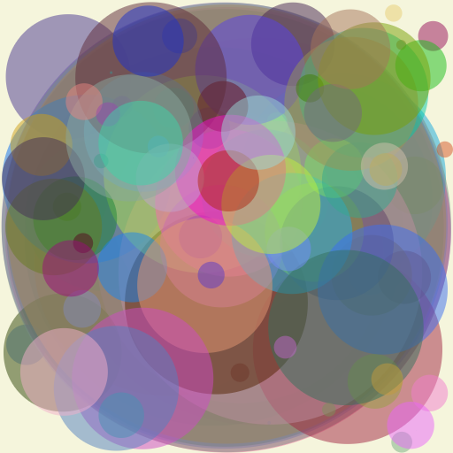 |
| 10% margins | `--margins 10%` | `rag mandrill.png --rng-seed 1 --painter-alpha 0.5 --painter circles --background-color beige --generations 100 --margins 10%` | 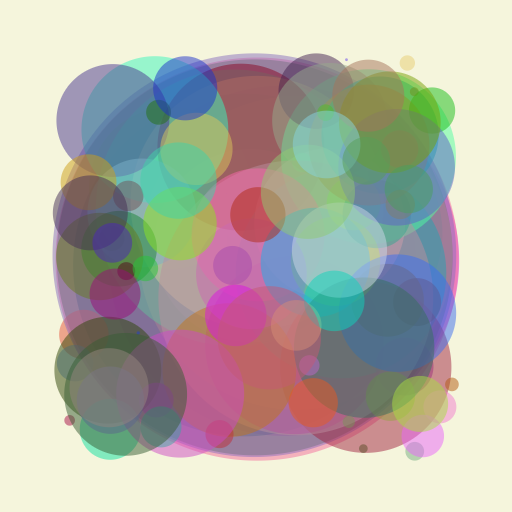 |
| -20% margins (bleed) | `--margins -20%` | `rag mandrill.png --rng-seed 1 --painter-alpha 0.5 --painter circles --background-color beige --generations 100 --margins -20%` | 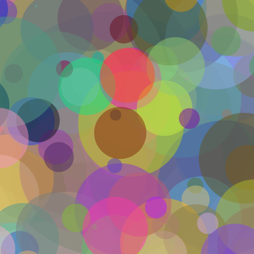 |
| 20px margin vertical, 25% margin horizontal | `--margins 20,25%` | `rag mandrill.png --rng-seed 1 --painter-alpha 0.5 --painter circles --background-color beige --generations 100 --margins 20,25%` | 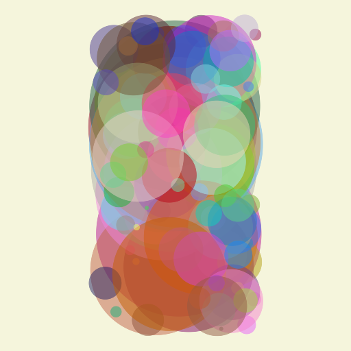 |
| 0px margin top, 40px right, 80px bottom, 120px left | `--margins 0,40,80,120` | `rag mandrill.png --rng-seed 1 --painter-alpha 0.5 --painter circles --background-color beige --generations 100 --margins 0,40,80,120` | 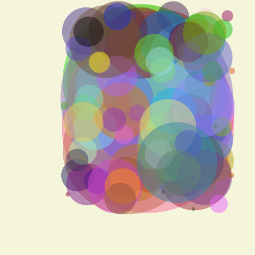 |

#### <a id="no-metadata"></a>`--no-metadata`

Disables writing image metadata.

By default, the output image file includes metadata with the software name and version, all generation statistics, and original command line arguments used, including original file names passed. With this flag set, nothing is written.

#### <a id="max-tries"></a>`-t`, `--max-tries <integer>`

Default: `0`

Type: [Integer](#type-integer)

Maximum number of image generation tries (successful or nor) to run.

On each try, the painter algorithm tries creating an image that is closer to the target image (with several "candidates" per try).

The more complex the result image gets, the harder it is to create an improved image, so it's common to have many unsuccessful tries. Use this option to set a maximum number of tries.

Using a limited number of tries can give a predicted time for completion, but also gives an unpredictable number of successful paints. Use the [`-g`/`--generations`](#generations) parameter to control the number of desired paints instead.

Set to `0` if no limit is desired.

| Example | Argument | Command line example | Result |
|-|-|-|-|
| 10 tries | `--max-tries 10` | `rag mandrill.png --rng-seed 1 --painter-alpha 0.2 --painter circles --background-color purple --max-tries 10` | 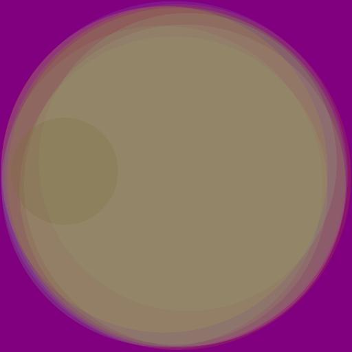 |
| 100 tries | `--max-tries 100` | `rag mandrill.png --rng-seed 1 --painter-alpha 0.2 --painter circles --background-color purple --max-tries 100` | 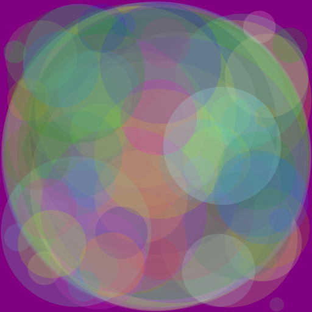 |
| 1000 tries | `--max-tries 1000` | `rag mandrill.png --rng-seed 1 --painter-alpha 0.2 --painter circles --background-color purple --max-tries 1000` | 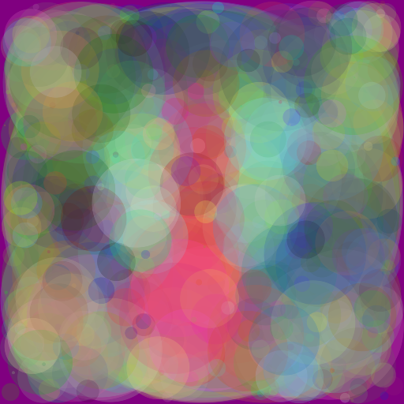 |

#### <a id="output"></a>`-o`, `--output <filename>`

Default: `output.png`

Type: File path or name string

The filename for the result image to be saved to.

On each successful generation, this file is rewritten with the results. Extensions such as `.png` or `.jpg` are allowed. More formats might be supported in the future.

If the destination file already exists, it is overwritten without warning.

#### <a id="painter"></a>`-p`, `--painter <painter>`

Default: `rects`

Type: One of `circles`, `strokes`, or `rects`

Painter to be used.

This determines how new candidates will be painted when trying to approximate the target image. A selection of basic painters currently exist.

Painters can be further configured with other `--painter-*` arguments.

| Example | Argument | Command line example | Result |
|-|-|-|-|
| Rects painter | `--painter rects` | `rag mandrill.png --generations 100 --rng-seed 1 --painter-alpha 0.9 --background-color beige --painter rects` | 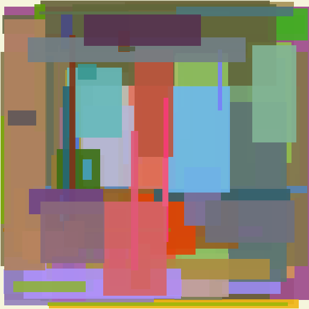 |
| Circles painter | `--painter circles` | `rag mandrill.png --generations 100 --rng-seed 1 --painter-alpha 0.9 --background-color beige --painter circles` | 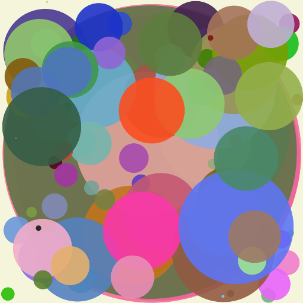 |
| Strokes painter | `--painter strokes` | `rag mandrill.png --generations 100 --rng-seed 1 --painter-alpha 0.9 --background-color beige --painter strokes` | 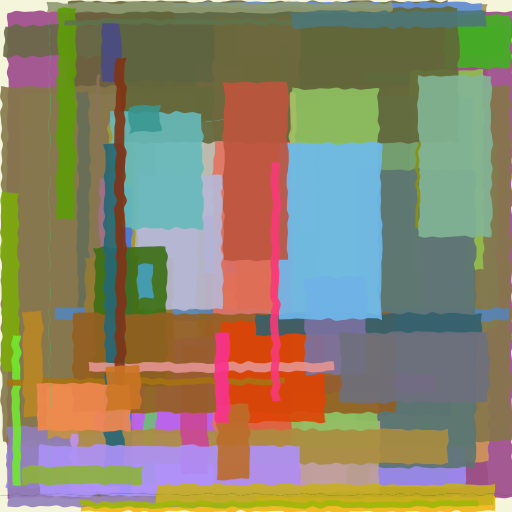 |

#### <a id="painter-alpha"></a>`--painter-alpha <scale>...`

Default: `1`

Type: Single entry or [list](#type-list), of [ranges](#type-range) or unique values, of opacity [floats](#type-float)

Opacity to use when painting new images.

This can be either a single value between `0.0` (fully transparent) and `1.0` (fully opaque), or a range in the same scale for randomized values.

The argument is a list, so it can also feature more than one value (or ranges, or a mix of values or ranges), in which case one new entry is randomly picked for each new paint.

| Example | Argument | Command line example | Result |
|-|-|-|-|
| Default (100%) | N/A | `rag mandrill.png --generations 100 --rng-seed 1 --color-seed 0.5 --painter strokes --background-color white --margins 5%` | 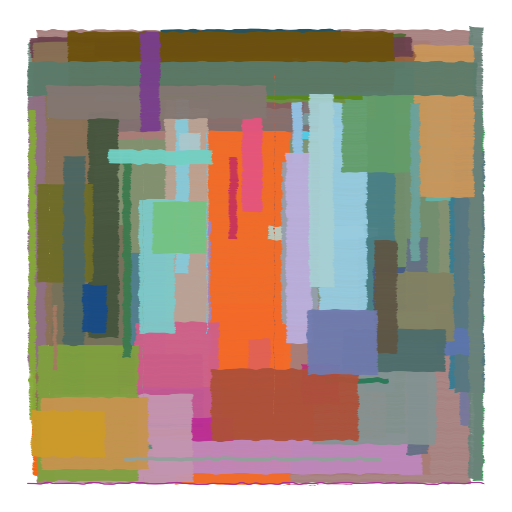 |
| 10% opacity | `--painter-alpha 0.1` | `rag mandrill.png --generations 100 --rng-seed 1 --color-seed 0.5 --painter strokes --background-color white --margins 5% --painter-alpha 0.1` | 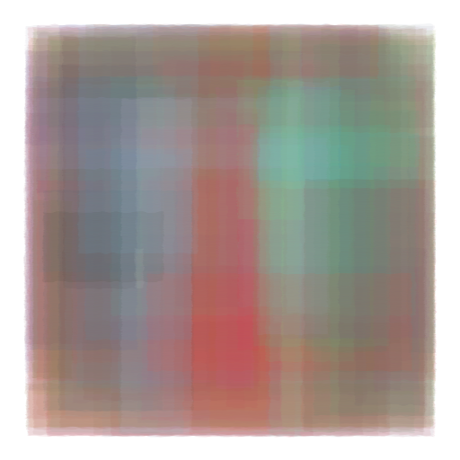 |
| 60% opacity | `--painter-alpha 0.6` | `rag mandrill.png --generations 100 --rng-seed 1 --color-seed 0.5 --painter strokes --background-color white --margins 5% --painter-alpha 0.6` | 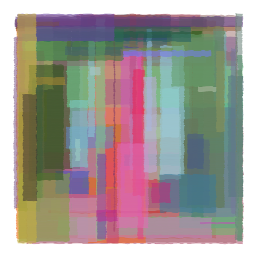 |
| 0%-100% opacity | `--painter-alpha 0-1` | `rag mandrill.png --generations 100 --rng-seed 1 --color-seed 0.5 --painter strokes --background-color white --margins 5% --painter-alpha 0-1` | 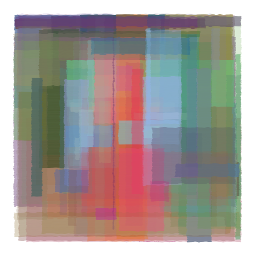 |
| 50% chance of 10% opacity, 40% chance of 50% opacity, 10% chance of 100% opacity | `--painter-alpha 0.1@5 0.5@4 1` | `rag mandrill.png --generations 100 --rng-seed 1 --color-seed 0.5 --painter strokes --background-color white --margins 5% --painter-alpha 0.1@5 0.5@4 1` | 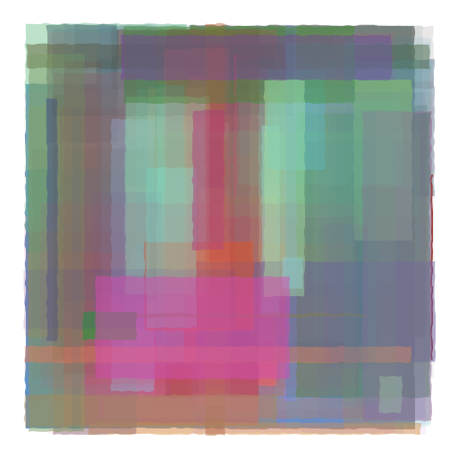 |
| 50% chance of 0-25% opacity, 50% chance of 75%-100% opacity | `--painter-alpha 0-0.25 0.75-1` | `rag mandrill.png --generations 100 --rng-seed 1 --color-seed 0.5 --painter strokes --background-color white --margins 5% --painter-alpha 0-0.25 0.75-1` | 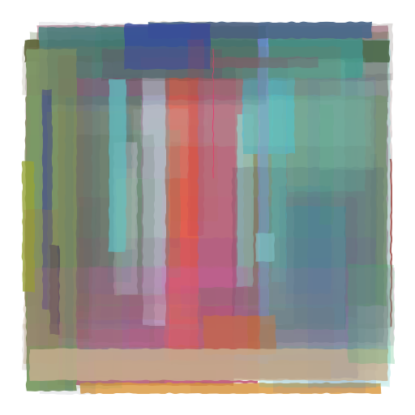 |

#### <a id="painter-alpha-bias"></a>`--painter-alpha-bias <bias>`

Default: `0`

Type: [Bias](#type-bias)

Bias for distribution in [`--painter-alpha`](#painter-alpha) ranges.

| Example | Argument | Command line example | Result |
|-|-|-|-|
| Alpha 0-1, no bias | N/A | `rag mandrill.png --generations 10 --rng-seed 1 --painter strokes --painter-width 5% --margins 5% --painter-alpha 0-1` | 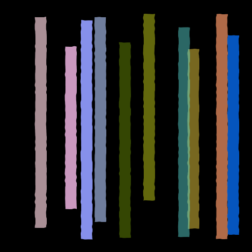 |
| Alpha 0-1, 2 bias towards 1 | `--painter-alpha-bias 2` | `rag mandrill.png --generations 10 --rng-seed 1 --painter strokes --painter-width 5% --margins 5% --painter-alpha 0-1 --painter-alpha-bias 2` | 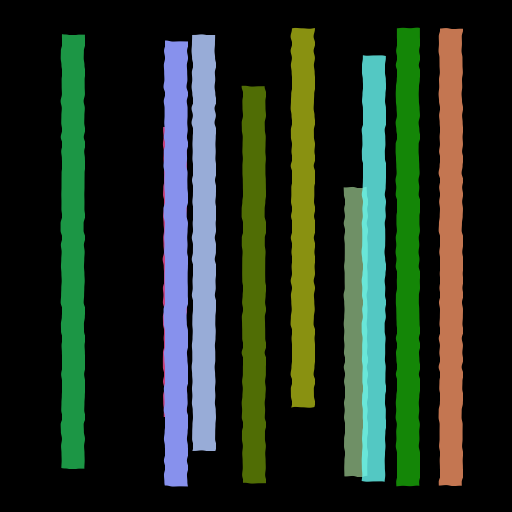 |
| Alpha 0-1, -2 bias towards 0 | `--painter-alpha-bias -2` | `rag mandrill.png --generations 10 --rng-seed 1 --painter strokes --painter-width 5% --margins 5% --painter-alpha 0-1 --painter-alpha-bias -2` | 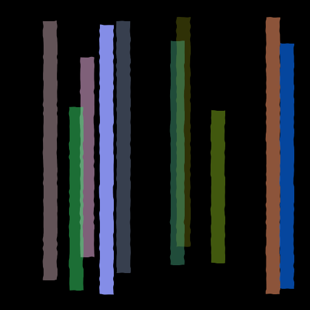 |
| Alpha 0-1, -16 bias towards 0 | `--painter-alpha-bias -16` | `rag mandrill.png --generations 10 --rng-seed 1 --painter strokes --painter-width 5% --margins 5% --painter-alpha 0-1 --painter-alpha-bias -16` | 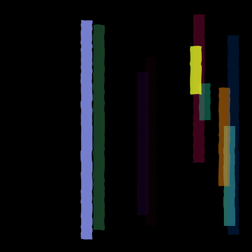 |

#### <a id="painter-disable-anti-alias"></a>`--painter-disable-anti-alias`

Disables calculating antialias on edges when painting new elements.

This makes rendering faster in some cases, but can produce jagged edges, and is therefore not recommended.

The one exception is when creating artwork meant to be printed. In that case, antialiased edges can produce dithering artifacts during the printing process; it is better to create an aliased result at a higher resolution instead (using [`--scale`](#scale)) to match the printer's resolution.

| Example | Argument | Command line example | Result |
|-|-|-|-|
| Default | N/A | `rag mandrill.png --generations 100 --rng-seed 1 --scale 0.1 --painter circles` |  |
| Disabled antialias | `--painter-disable-anti-alias` | `rag mandrill.png --generations 100 --rng-seed 1 --scale 0.1 --painter circles --painter-disable-anti-alias` |  |

#### <a id="painter-height"></a>`--painter-height <size>...`

Default: `0%-100%`

Type: Single entry or [list](#type-list) of [sizes](#type-size)

Height to use when painting elements.

This applies when [`--painter`](#painter) is set to `rects` or `strokes`. In case a percentage value is passed, it is relative to the height of the result image.

The argument is a list, so it can also feature more than one value (or ranges, or a mix of values or ranges), in which case one new entry is randomly picked for each new paint.

| Example | Argument | Command line example | Result |
|-|-|-|-|
| Default (0%-100%) | N/A | `rag mandrill.png --generations 20 --rng-seed 1` | 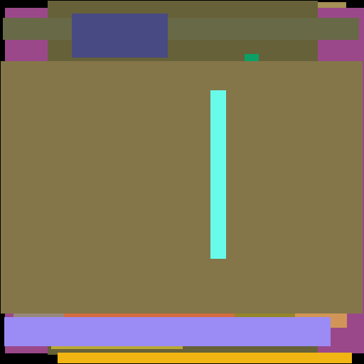 |
| Always 10% height | `--painter-height 10%` | `rag mandrill.png --generations 20 --rng-seed 1 --painter-height 10%` |  |
| Always 100px height | `--painter-height 100` | `rag mandrill.png --generations 20 --rng-seed 1 --painter-height 100` | 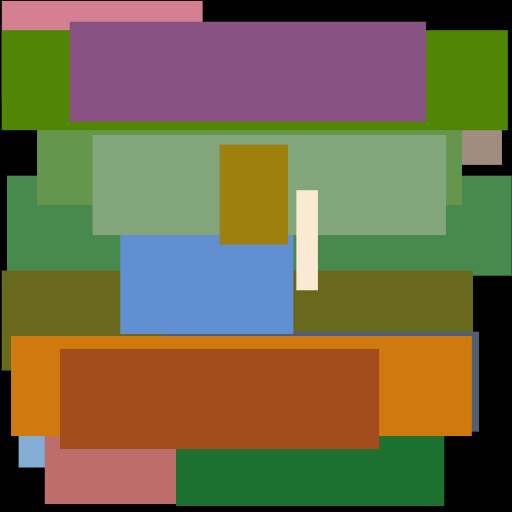 |
| Either 5%, 10%, 15%, or 20% height | `--painter-height 5% 10% 15% 20%` | `rag mandrill.png --generations 20 --rng-seed 1 --painter-height 5% 10% 15% 20%` | 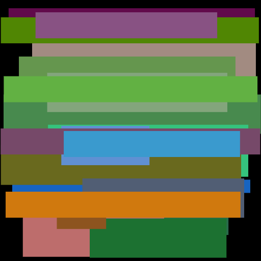 |
| 25% chance of 5% height, 75% chance of random 100px-200px height | `--painter-height 5% 100-200@3` | `rag mandrill.png --generations 20 --rng-seed 1 --painter-height 5% 100-200@3` | 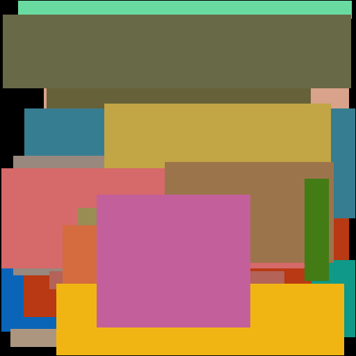 |

#### <a id="painter-height-bias"></a>`--painter-height-bias <bias>`

Default: `0`

Type: [Bias](#type-bias)

Bias for distribution in [`--painter-height`](#painter-height) ranges.

| Example | Argument | Command line example | Result |
|-|-|-|-|
| Height 0%-100% (default), no bias (default) | N/A | `rag mandrill.png --generations 20 --rng-seed 1 --painter-width 10` | 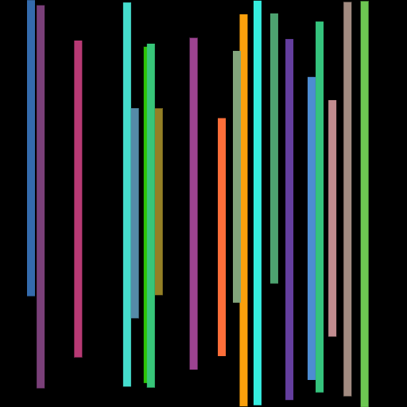 |
| Height 0%-100% (default), 16 bias towards 100% | `--painter-height-bias 16` | `rag mandrill.png --generations 20 --rng-seed 1 --painter-width 10 --painter-height-bias 16` | 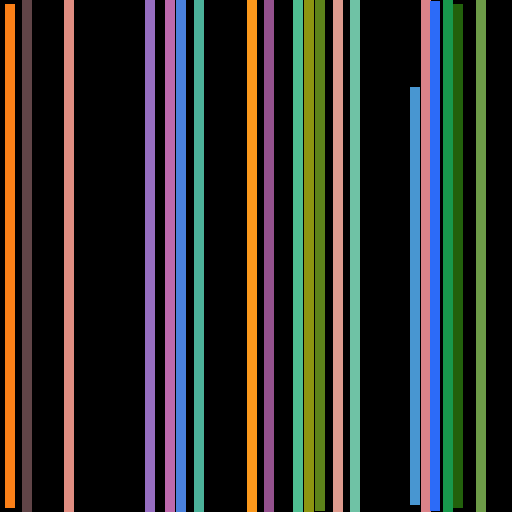 |
| Height 0%-100% (default), -16 bias towards 0% | `--painter-height-bias -16` | `rag mandrill.png --generations 20 --rng-seed 1 --painter-width 10 --painter-height-bias -16` | 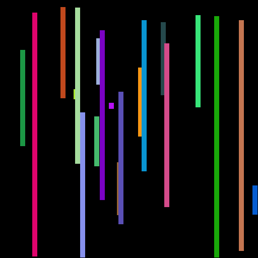 |
| Height 10%-50%, no bias (default) | `--painter-height 10%-50%` | `rag mandrill.png --generations 20 --rng-seed 1 --painter-width 10 --painter-height 10%-50%` | 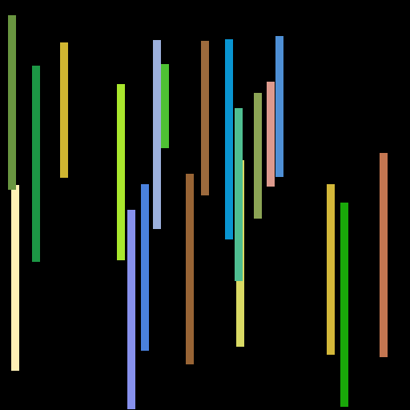 |
| Height 10%-50%, -4 bias towards 10% | `--painter-height 10%-50% --painter-height-bias -4` | `rag mandrill.png --generations 20 --rng-seed 1 --painter-width 10 --painter-height 10%-50% --painter-height-bias -4` | 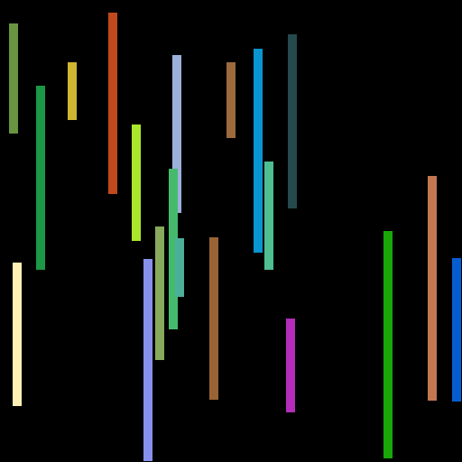 |

#### <a id="painter-radius"></a>`--painter-radius <size>...`

Default: `0%-50%`

Type: Single entry or [list](#type-list) of [sizes](#type-size)

Radius to use when painting elements, when applicable.

This applies when [`--painter`](#painter) is set to `circles`. In case a percentage value is passed, it is relative to either the width or height of the result image (whichever is smaller).

The argument is a list, so it can also feature more than one value (or ranges, or a mix of values or ranges), in which case one new entry is randomly picked for each new paint.

| Example | Argument | Command line example | Result |
|-|-|-|-|
| Default (0%-50%) | N/A | `rag mandrill.png --generations 20 --rng-seed 1 --background-color pink --painter-alpha 0.5 --painter circles` | 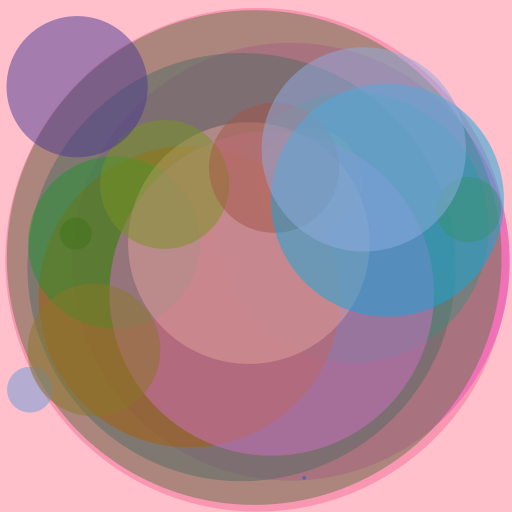 |
| Always 10% radius | `--painter-radius 10%` | `rag mandrill.png --generations 20 --rng-seed 1 --background-color pink --painter-alpha 0.5 --painter circles --painter-radius 10%` | 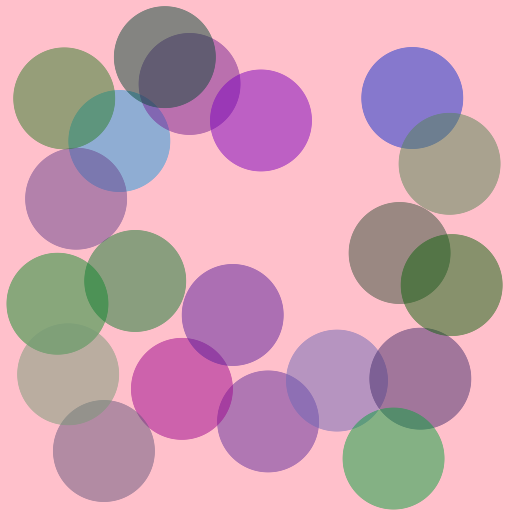 |
| Either 16px or 32px radius | `--painter-radius 16 32` | `rag mandrill.png --generations 20 --rng-seed 1 --background-color pink --painter-alpha 0.5 --painter circles --painter-radius 16 32` | 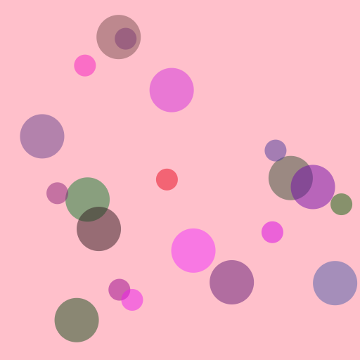 |
| Radius 200px-50% | `--painter-radius 200-50%` | `rag mandrill.png --generations 20 --rng-seed 1 --background-color pink --painter-alpha 0.5 --painter circles --painter-radius 200-50%` | 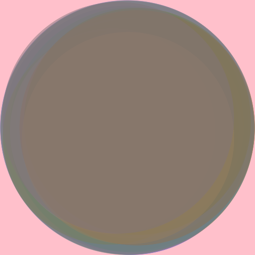 |

#### <a id="painter-radius-bias"></a>`--painter-radius-bias <bias>`

Default: `0`

Type: [Bias](#type-bias)

Bias for distribution in [`--painter-radius`](#painter-radius) ranges.

| Example | Argument | Command line example | Result |
|-|-|-|-|
| Radius 0%-50% (default), no bias (default) | N/A | `rag mandrill.png --generations 200 --rng-seed 1 --painter circles` | 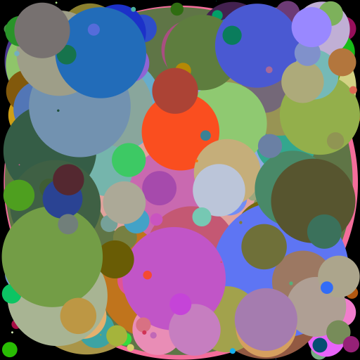 |
| Radius 0%-50% (default), 16 bias towards 50% | `--painter-radius-bias 16` | `rag mandrill.png --generations 200 --rng-seed 1 --painter circles --painter-radius-bias 16` | 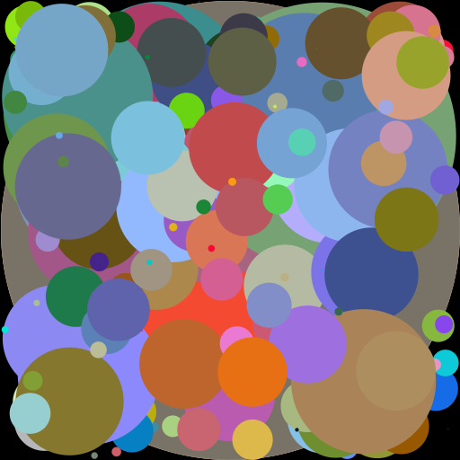 |
| Radius 0%-50% (default), -16 bias towards 0% | `--painter-radius-bias -16` | `rag mandrill.png --generations 200 --rng-seed 1 --painter circles --painter-radius-bias -16` | 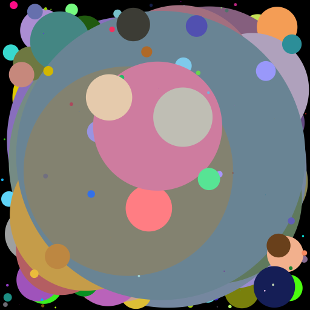 |
| Radius 2px-10% (default), -2 bias towards 2px | `--painter-radius-bias -2` | `rag mandrill.png --generations 200 --rng-seed 1 --painter circles --painter-radius 2-10% --painter-radius-bias -2` | 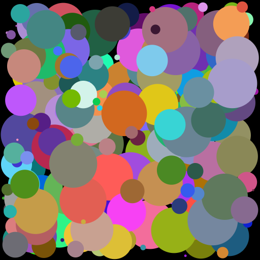 |

#### <a id="painter-rotation"></a>`--painter-rotation <float>...`

Default: `0`

Type: Single entry or [list](#type-list), of [ranges](#type-range) or unique values, of rotation [floats](#type-float)

Rotation in degrees for painted elements, when applicable.

This applies when [`--painter`](#painter) is set to `rects`.

When used, this applies a clockwise rotation to the elements. Values expressed here need to be positive. To apply a counter-clockwise rotation, apply a full rotation value to it first; for example, a rotation of `355` is equivalent to `-5` (or `5` counter-clockwise).

The argument is a list, so it can also feature more than one value (or ranges, or a mix of values or ranges), in which case one new entry is randomly picked for each new paint.

| Example | Argument | Command line example | Result |
|-|-|-|-|
| Default (0) | N/A | `rag mandrill.png --generations 400 --rng-seed 1 --background-color beige --painter-alpha 0.5-0.9 --painter rects --painter-height 4%` | 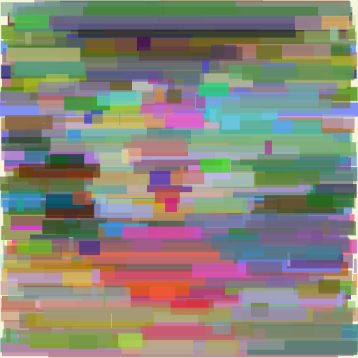 |
| Always 45" rotation | `--painter-rotation 45` | `rag mandrill.png --generations 400 --rng-seed 1 --background-color beige --painter-alpha 0.5-0.9 --painter rects --painter-height 4% --painter-rotation 45` | 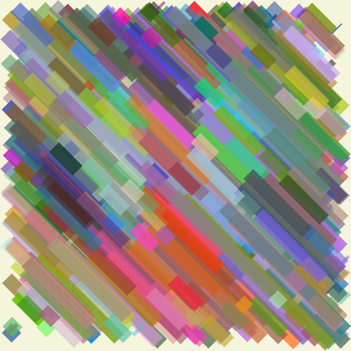 |
| Between -10" and 10" rotation | `--painter-rotation 350-370` | `rag mandrill.png --generations 400 --rng-seed 1 --background-color beige --painter-alpha 0.5-0.9 --painter rects --painter-height 4% --painter-rotation 350-370` | 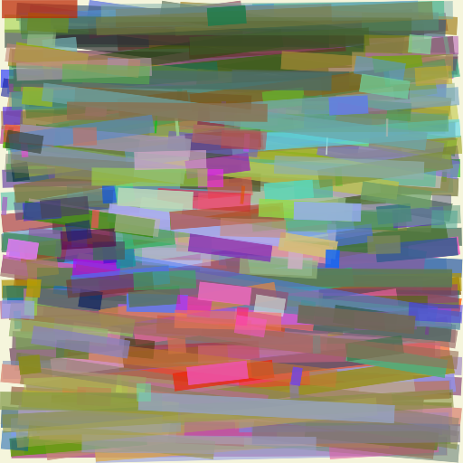 |
| Either 0" or 90" rotation | `--painter-rotation 0 90` | `rag mandrill.png --generations 400 --rng-seed 1 --background-color beige --painter-alpha 0.5-0.9 --painter rects --painter-height 4% --painter-rotation 0 90` | 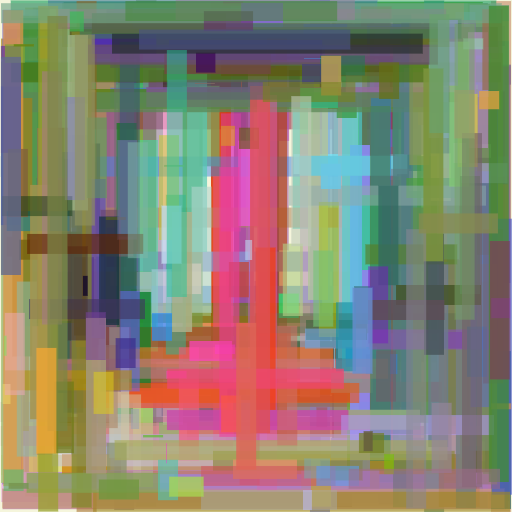 |
| Any rotation | `--painter-rotation 0-360` | `rag mandrill.png --generations 400 --rng-seed 1 --background-color beige --painter-alpha 0.5-0.9 --painter rects --painter-height 4% --painter-rotation 0-360` | 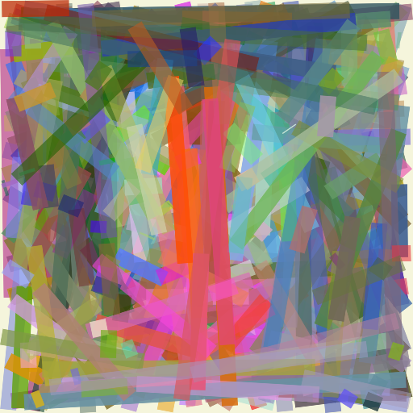 |
| Any rotation, thin lines | `--painter-rotation 0-360` | `rag mandrill.png --generations 2000 --rng-seed 1 --background-color beige --painter-alpha 0.9 --painter rects --painter-height 3 --painter-rotation 0-360` | 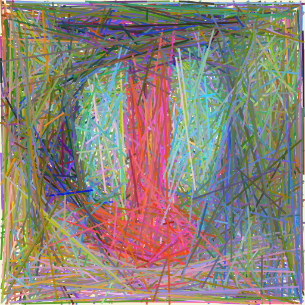 |


#### <a id="painter-wave-height"></a>`--painter-wave-height <size>...`

Default: `0.5%`

Type: Single entry or [list](#type-list) of [sizes](#type-size)

Height of paint waves, when applicable.

This applies when [`--painter`](#painter) is set to `strokes`. In case a percentage value is passed, it is always relative to the width of the result image.

In the `strokes` painter, *waves* are the deformations that occur on the edges of each painted element. The waves have a *height* (their strength, perpendicular to the edge itself) and a *length* (the size of an entire wave along the direction of the edge). The higher the wave, the stronger they look.

| Example | Argument | Command line example | Result |
|-|-|-|-|
| Default (0.5%) | N/A | `rag mandrill.png --generations 20 --rng-seed 1 --background-color darkgreen --painter strokes` | 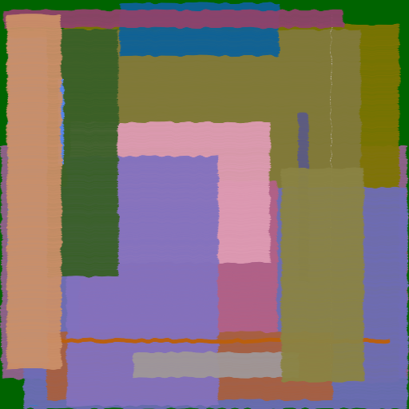 |
| Always 2% wave height | `--painter-wave-height 2%` | `rag mandrill.png --generations 20 --rng-seed 1 --background-color darkgreen --painter strokes --painter-wave-height 2%` | 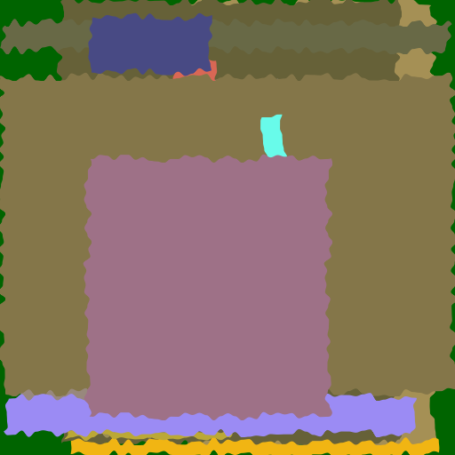 |
| Wave height 10px-20px | `--painter-wave-height 10-20` | `rag mandrill.png --generations 20 --rng-seed 1 --background-color darkgreen --painter strokes --painter-wave-height 10-20` | 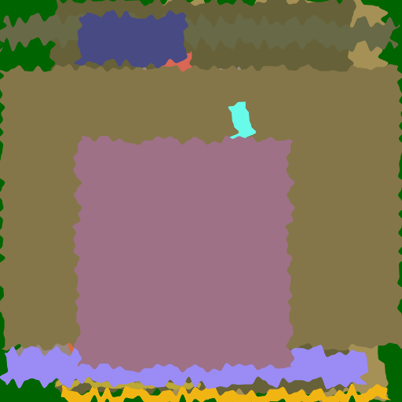 |
| Either 50px, 90px, or 1px-4% wave height | `--painter-wave-height 50 90 1-4%` | `rag mandrill.png --generations 20 --rng-seed 1 --background-color darkgreen --painter strokes --painter-wave-height 50 90 1-4%` | 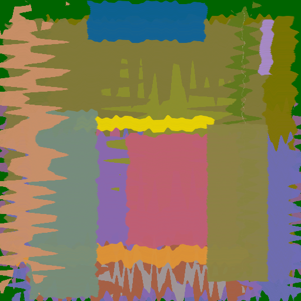 |

#### <a id="painter-wave-height-bias"></a>`--painter-wave-height-bias <bias>`

Default: `0`

Type: [Bias](#type-bias)

Bias for distribution in [`--painter-wave-height`](#painter-wave-height) ranges.

| Example | Argument | Command line example | Result |
|-|-|-|-|
| Wave height 0%-10%, no bias (default) | N/A | `rag mandrill.png --generations 20 --rng-seed 1 --background-color darkred --painter strokes --painter-wave-height 0%-10%` | 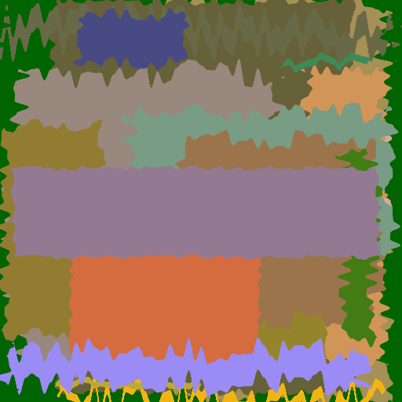 |
| Wave height 0%-10%, -16 bias towards 0% | `--painter-wave-height-bias -16` | `rag mandrill.png --generations 20 --rng-seed 1 --background-color darkred --painter strokes --painter-wave-height 0%-10% --painter-wave-height-bias -16` | 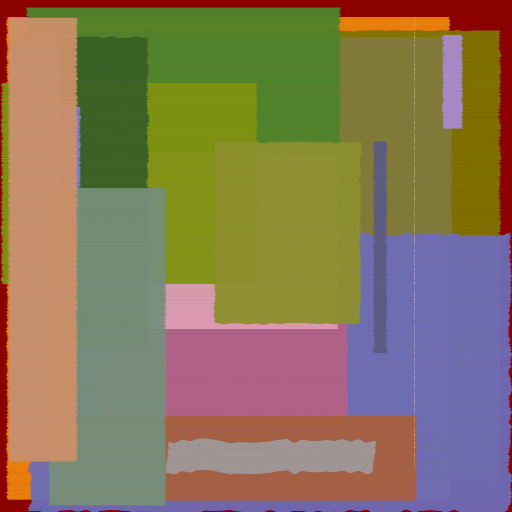 |
| Wave height 0%-10%, 16 bias towards 10% | `--painter-wave-height-bias 16` | `rag mandrill.png --generations 20 --rng-seed 1 --background-color darkred --painter strokes --painter-wave-height 0%-10% --painter-wave-height-bias 16` | 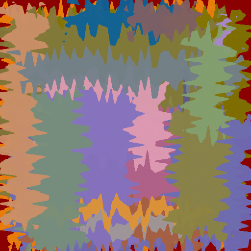 |

#### <a id="painter-wave-length"></a>`--painter-wave-length <size>...`

Default: `400%`

Type: Single entry or [list](#type-list) of [sizes](#type-size)

Length of paint waves, when applicable.

This applies when [`--painter`](#painter) is set to `strokes`. In case a percentage value is passed, it is always relative to the height of the result image.

In the `strokes` painter, *waves* are the deformations that occur on the edges of each painted element. The waves have a *height* (their strength, perpendicular to the edge itself) and a *length* (the size of an entire wave along the direction of the edge). This length encompasses a set of different waves (rather than just one wave), to create a noise-like pattern. The bigger the length, the gentler the wave looks, similarly to producing a sound wave of lower frequency.

| Example | Argument | Command line example | Result |
|-|-|-|-|
| Default (400%) | N/A | `rag mandrill.png --generations 20 --rng-seed 1 --background-color darkgreen --painter strokes` | 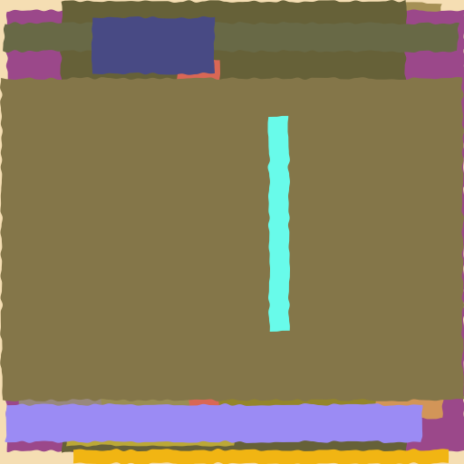 |
| Wave length of 200% | `--painter-wave-length 200%` | `rag mandrill.png --generations 20 --rng-seed 1 --background-color wheat --painter strokes --painter-wave-length 200%` | 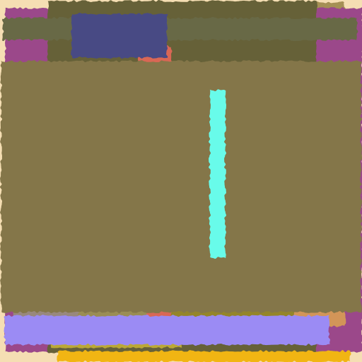 |
| Wave length of 4000% | `--painter-wave-length 4000%` | `rag mandrill.png --generations 20 --rng-seed 1 --background-color wheat --painter strokes --painter-wave-length 4000%` | 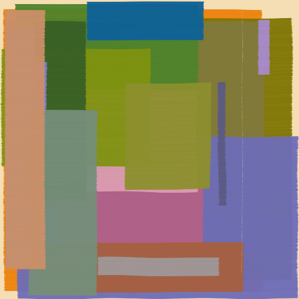 |
| Wave length of 100px | `--painter-wave-length 100` | `rag mandrill.png --generations 20 --rng-seed 1 --background-color wheat --painter strokes --painter-wave-length 100` | 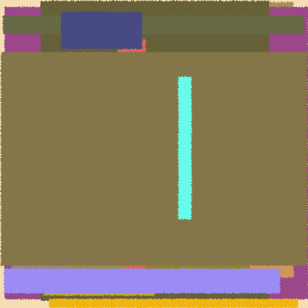 |
| Either 10% (25% chance), 400% (25% chance), or 8000% (50% chance) wave length, with 2% wave height | `--painter-wave-height 2% --painter-wave-length 10% 400% 8000%@2` | `rag mandrill.png --generations 20 --rng-seed 1 --background-color wheat --painter strokes --painter-wave-height 2% --painter-wave-length 10% 400% 8000%@2` | 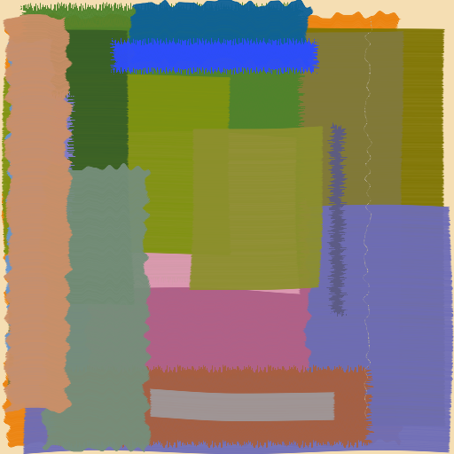 |

#### <a id="painter-wave-length-bias"></a>`--painter-wave-length-bias <bias>`

Default: `0`

Type: [Bias](#type-bias)

Bias for distribution in [`--painter-wave-length`](#painter-wave-length) ranges.

| Example | Argument | Command line example | Result |
|-|-|-|-|
| Wave length 1%-4000%, no bias (default) | N/A | `rag mandrill.png --generations 40 --rng-seed 1 --background-color snow --painter strokes --painter-height 4% --painter-width 90%-100% --painter-alpha 0.5-1 --painter-wave-length 1%-4000%` | 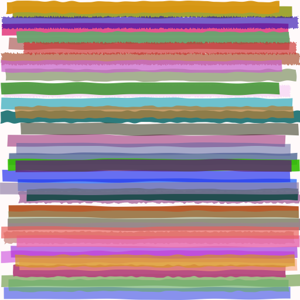 |
| Wave height 1%-4000%, -16 bias towards 1% | `--painter-wave-length-bias -16` | `rag mandrill.png --generations 40 --rng-seed 1 --background-color snow --painter strokes --painter-height 4% --painter-width 90%-100% --painter-alpha 0.5-1 --painter-wave-length 1%-4000% --painter-wave-length-bias -16` |  |
| Wave height 1%-4000%, 16 bias towards 4000% | `--painter-wave-length-bias 16` | `rag mandrill.png --generations 40 --rng-seed 1 --background-color snow --painter strokes --painter-height 4% --painter-width 90%-100% --painter-alpha 0.5-1 --painter-wave-length 1%-4000% --painter-wave-length-bias 16` | 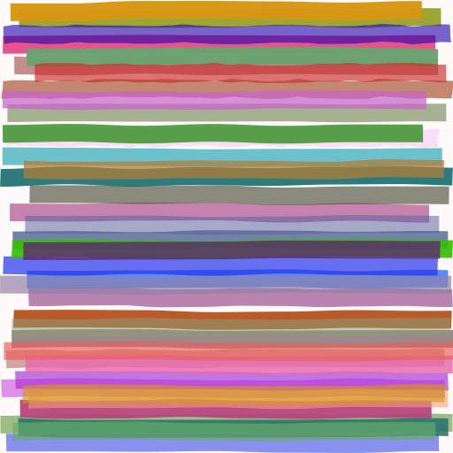 |

#### <a id="painter-width"></a>`--painter-width <size>...`

Default: `0%-100%`

Type: Single entry or [list](#type-list) of [sizes](#type-size)

Width to use when painting elements.

This applies when [`--painter`](#painter) is set to `rects` or `strokes`. In case a percentage value is passed, it is relative to the width of the result image.

The argument is a list, so it can also feature more than one value (or ranges, or a mix of values or ranges), in which case one new entry is randomly picked for each new paint.

| Example | Argument | Command line example | Result |
|-|-|-|-|
| Default (0%-100%) | N/A | `rag mandrill.png --generations 20 --background-color whitesmoke --rng-seed 1 --painter-height 5% --margins 4%` | 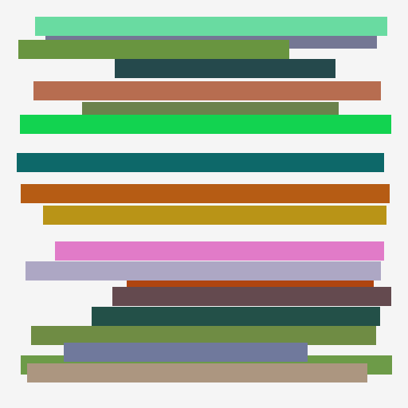 |
| Always 50% width | `--painter-width 50%` | `rag mandrill.png --generations 20 --background-color whitesmoke --rng-seed 1 --painter-height 5% --margins 4% --painter-width 50%` | 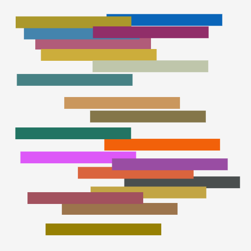 |
| Always 80px width | `--painter-width 80` | `rag mandrill.png --generations 20 --background-color whitesmoke --rng-seed 1 --painter-height 5% --margins 4% --painter-width 80` | 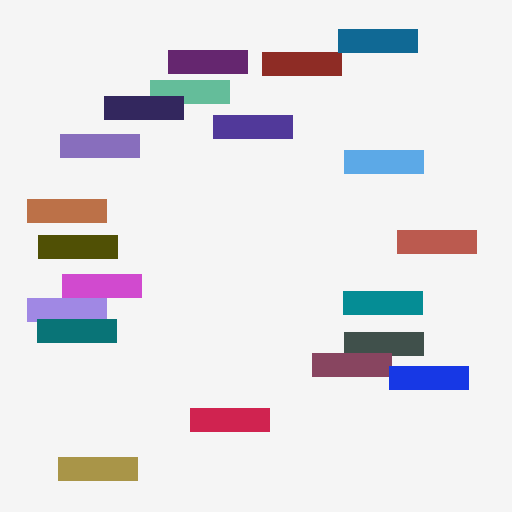 |
| Either 25%, 50%, 75%, or 100% width | `--painter-width 25% 50% 75% 100%` | `rag mandrill.png --generations 20 --background-color whitesmoke --rng-seed 1 --painter-height 5% --margins 4% --painter-width 25% 50% 75% 100%` | 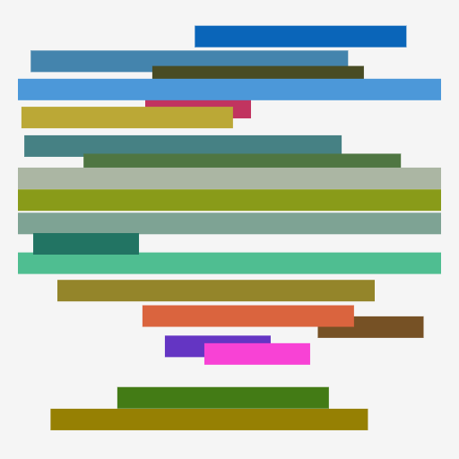 |

#### <a id="painter-width-bias"></a>`--painter-width-bias <bias>`

Default: `0`

Type: [Bias](#type-bias)

Bias for distribution in [`--painter-width`](#painter-width) ranges.

| Example | Argument | Command line example | Result |
|-|-|-|-|
| Width 0%-100% (default), no bias (default) | N/A | `rag mandrill.png --generations 30 --painter strokes --background-color gainsboro --rng-seed 1 --painter-height 4% --margins 4%` | 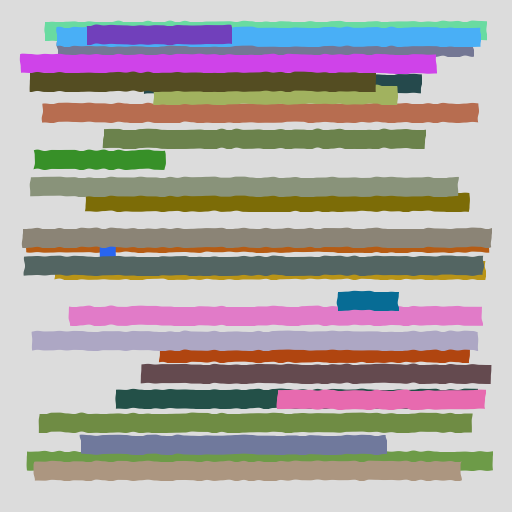 |
| Width 0%-100% (default), 16 bias towards 100% | `--painter-width-bias 16` | `rag mandrill.png --generations 30 --painter strokes --background-color gainsboro --rng-seed 1 --painter-height 4% --margins 4% --painter-width-bias 16` | 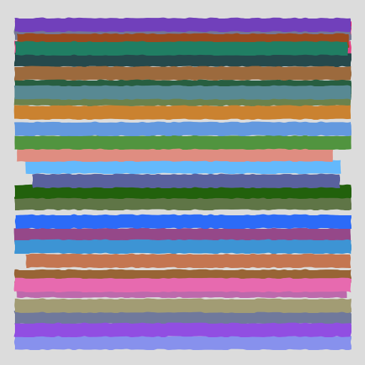 |
| Width 0%-100% (default), -16 bias towards 0% | `--painter-width-bias -16` | `rag mandrill.png --generations 30 --painter strokes --background-color gainsboro --rng-seed 1 --painter-height 4% --margins 4% --painter-width-bias -16` | 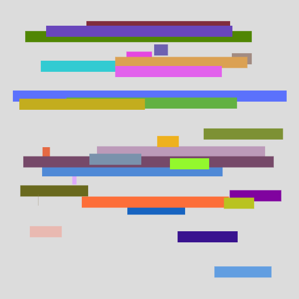 |
| Width 10px-40%, 4 bias towards 40% | `--painter-width 10-40% --painter-width-bias 4` | `rag mandrill.png --generations 30 --painter strokes --background-color gainsboro --rng-seed 1 --painter-height 4% --margins 4% --painter-width 10-40% --painter-width-bias 4` | 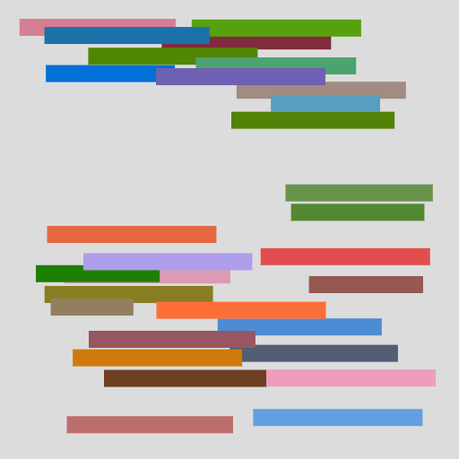 |

#### <a id="rng-seed"></a>`--rng-seed <integer>`

Default: `0`

Type: [Integer](#type-integer)

The seed to use for the pseudorandom number generator.

This should be an unsigned 32-but integer number (that is, between and `0` and `4294967295`, inclusive). If `0` is passed, the seed iself is randomized.

When generating new candidates, the application tries creating new images in a randomized, but *deterministic*, fashion. This means that as long as all inputs - target images, parameters - are the same, the end result will always be the same.

To allow for that but also an element of unpredictability, it uses a *random seed* which is a number that determines the point in the random number sequence where new random numbers will come from.

In other words, re-running the application repeated times with the same value for `--rng-seed` should always produce the same result. This is useful in case a particularly interesting image is generated; in this case, it's worth re-running the application with a higher [`--scale`](#scale) value, to create a larger image (e.g. for printing).

When no seed is passed, one is chosen at random, and both printed during the program's output, and added to the generated file's metadata, in case one wants to recreate the result image.

Bias for distribution in [`--painter-width`](#painter-width) ranges.

| Example | Argument | Command line example | Result |
|-|-|-|-|
| With default (random) seed | N/A | `rag mandrill.png --generations 100 --painter-alpha 0.7 --margins -10%` | 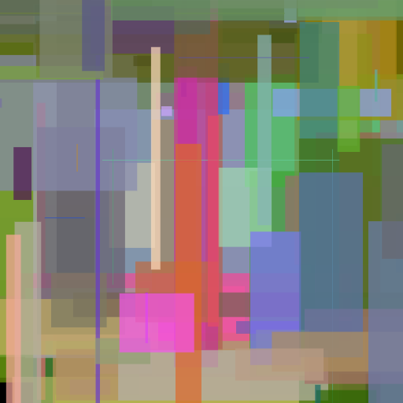 |
| Using seed 1 | `--rng-seed 1` | `rag mandrill.png --generations 100 --painter-alpha 0.7 --margins -10% --rng-seed 1` | 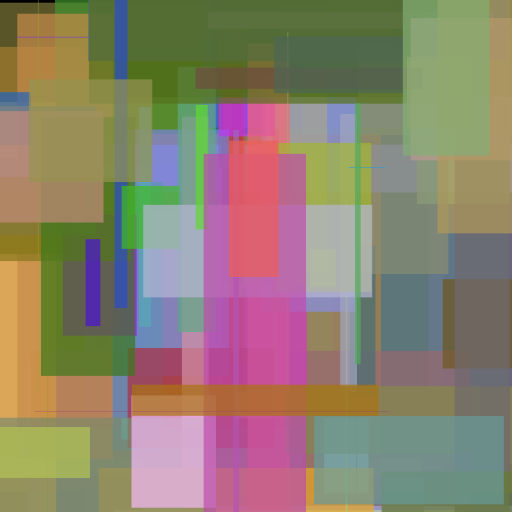 |
| Using seed 2 | `--rng-seed 2` | `rag mandrill.png --generations 100 --painter-alpha 0.7 --margins -10% --rng-seed 2` | 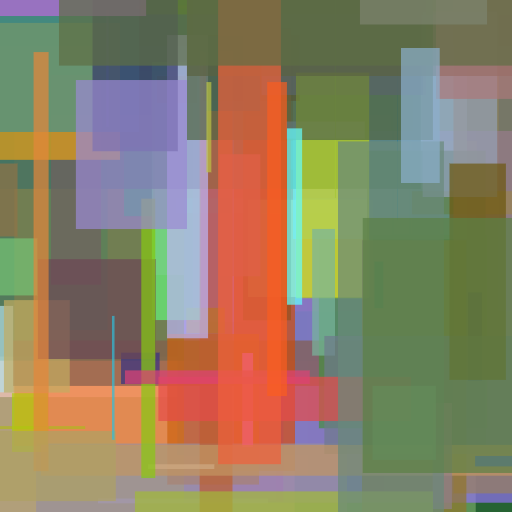 |

#### <a id="scale"></a>`-s`, `--scale <float>`

Default: `0`

Type: [Float](#type-float)

The new size of the output image, as a scale of the target image.

This is useful if one wants the result image to be either smaller or larger than the target image.

Larger images tend to take more time to generate. It's useful to try and generate smaller images (or of the same size as the target) when trying out parameters, and once one is happy with the results, regenerate the image using a larger scale and the same random number generator seed used in the original result (via [`--rng-seed`](#rng-seed)).

| Example | Argument | Command line example | Result |
|-|-|-|-|
| Same size as target (default) | N/A | `rag mandrill.png --generations 100 --rng-seed 1 --painter strokes --painter-alpha 0.7 --painter-width 5% --margins 8%` | 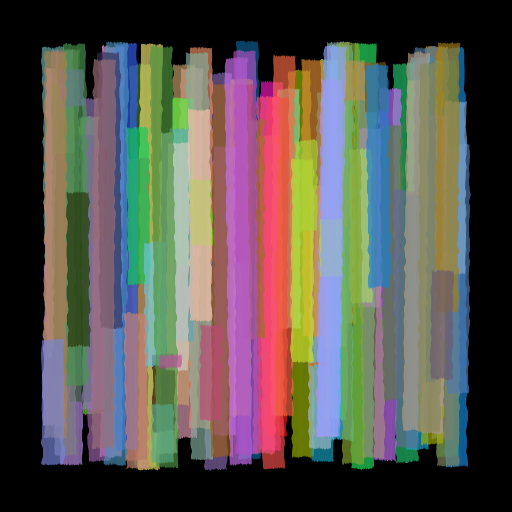 |
| Scaled to 4x the target size | `--scale 4` | `rag mandrill.png --generations 100 --rng-seed 1 --painter strokes --painter-alpha 0.7 --painter-width 5% --margins 8% --scale 4` | 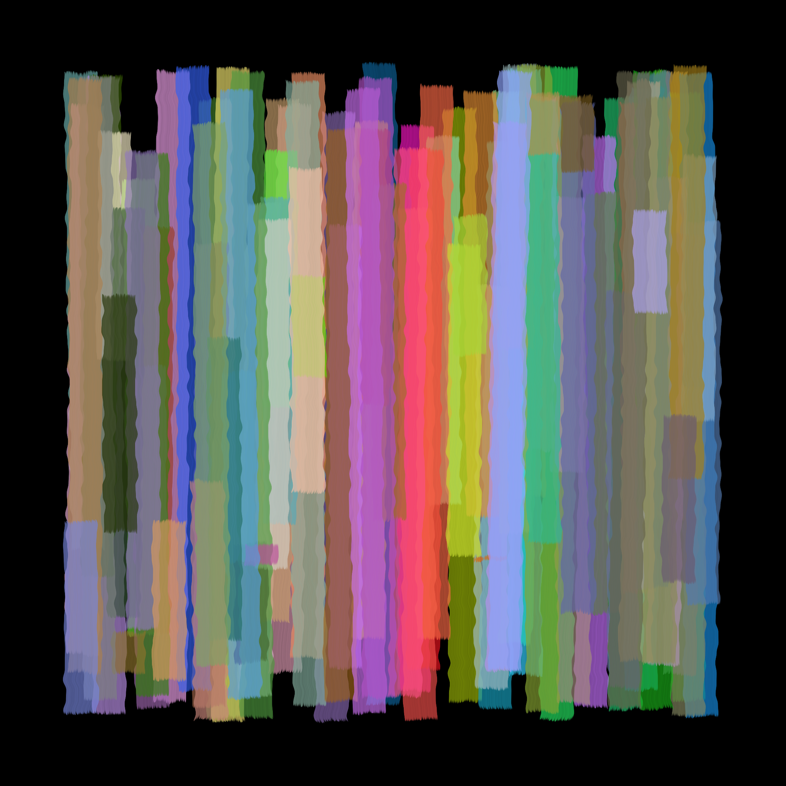 |
| Scaled to 10% of the target size | `--scale 0.1` | `rag mandrill.png --generations 100 --rng-seed 1 --painter strokes --painter-alpha 0.7 --painter-width 5% --margins 8% --scale 0.1` |  |

#### <a id="save-often"></a> `--save-often`

Save the output file more frequently.

The default behavior for the application is to only write the final output file when the target generations, tries, or diff are achieved. With this flag, the output file will be saved frequently, on every successful generation.

This is useful if one expects to be interrupting the writing process in the middle.

#### <a id="target-color-matrix"></a>`--target-color-matrix <color-matrix>`

Default: none

Type: 3x4 [float](#type-float) matrix as a comma-separated array

Color matrix to be applied to the target image before using it.

This allows one to change how colors in the target image are perceived by the system when determining whether a newly painted candidate is close to the target or not. While editing the target image on an image editor (by changing its colors) prior to running Random Art Generator has the same effect, running a color matrix transformation as part of the application can help automate the generation process.

This is a (somewhat) typical 3x4 matrix for color transformations between RGB channels, in the format:

```
r_from_r, r_from_g, r_from_b, r_offset,
g_from_r, g_from_g, g_from_b, g_offset,
b_from_r, b_from_g, b_from_b, b_offset
```

For example, the *identity* matrix (equivalent to no change) is `1,0,0,0,0,1,0,0,0,0,1,0`.

| Example | Argument | Command line example | Result |
|-|-|-|-|
| No matrix (default) | N/A | `rag mandrill.png --generations 300 --rng-seed 1 --color-seed 1 --painter strokes --painter-alpha 0.1-0.7 --painter-height 2%-4% --margins 8% --background-color beige` | 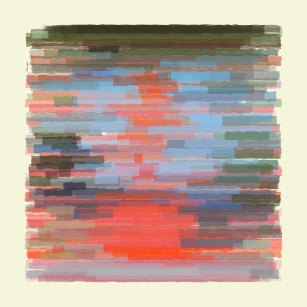 |
| Luma-based grayscale | `--target-color-matrix 0.33,0.59,0.11,0,0.33,0.59,0.11,0,0.33,0.59,0.11,0` | `rag mandrill.png --generations 300 --rng-seed 1 --color-seed 1 --painter strokes --painter-alpha 0.1-0.7 --painter-height 2%-4% --margins 8% --background-color beige --target-color-matrix 0.33,0.59,0.11,0,0.33,0.59,0.11,0,0.33,0.59,0.11,0` | 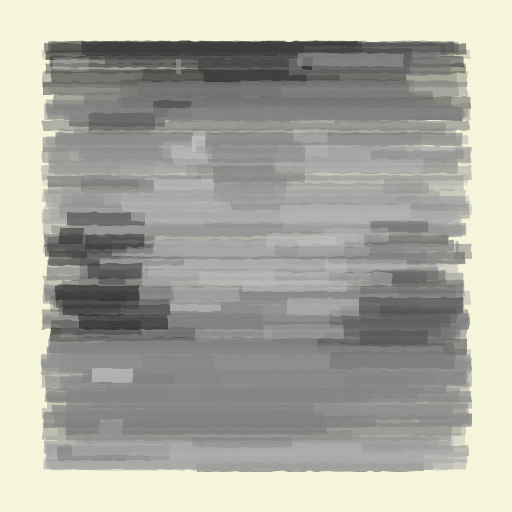 |
| Sepia | `--target-color-matrix 0.393,0.769,0.686,0,0.349,0.686,0.168,0,0.272,0.534,0.131,0` | `rag mandrill.png --generations 300 --rng-seed 1 --color-seed 1 --painter strokes --painter-alpha 0.1-0.7 --painter-height 2%-4% --margins 8% --background-color beige --target-color-matrix 0.393,0.769,0.686,0,0.349,0.686,0.168,0,0.272,0.534,0.131,0` | 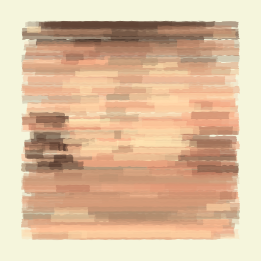 |
| Polaroid | `--target-color-matrix 1.438,0.122,-0.016,-8,-0.062,1.378,-0.016,-13,-0.062,-0.122,1.483,-5` | `rag mandrill.png --generations 300 --rng-seed 1 --color-seed 1 --painter strokes --painter-alpha 0.1-0.7 --painter-height 2%-4% --margins 8% --background-color beige --target-color-matrix 1.438,0.122,-0.016,-8,-0.062,1.378,-0.016,-13,-0.062,-0.122,1.483,-5` |  |

#### <a id="verbose"></a>`-v`, `--verbose`

Print additional information to the output.

This includes information about the graphics adapter used, some limits, process results, etc.

#### <a id="version"></a>`--version`

Prints version information.

### All data types

While the command line is a string, it accepts parameters that expect data in several different formats.

Some arguments might expect data in custom formats, but these are the more generic data types:

#### <a id="type-bias"></a>Bias

A bias is a float value that denotes how numbers are randomized from potential range values. This allows the application to generate random values that are *biased* toward the begin or end of ranges, effectively making either side of the range more frequent when painting.

For example, consider the range `0.0-1.0`. Normally, using that range in any input (for example, `--painter-alpha`) would mean the application would randomly select a value between `0.0` and `1.0` with equal probabilities; in other words, using a *linear distribution*.

This linear distribution is the equivalent of a bias of `0.0`, the default when a range is present.

However, using a bias, one can move the needle in either direction of the range. When using a *negative* bias (values below `0.0`), the randomization of the range is biased towards the low end of the range, and a positive (higher than `0.0` value) means a bias towards the high end of the range.

Given an input `bias`, a range minimum `min`, and a maximum `max`, the calculation for a random number in a range works like this (in pseudocode):

```
r = random_in_range(0, 1);
if bias < 0 {
    r = power(r, -bias + 1);
} else if bias > 0 {
    r = 1 - power(1 - r, bias + 1);
}
return min + r * (max - min)
```

In practice, this is how what it means, given a `0.0-1.0` range:

* Bias `-2.0`: cubic bias towards `0.0`; e.g. 50% chance of a number between `0.0` and `0.125`, and 50% chance of a number between `0.125` and `1.0`
* Bias `-1.0`: quadratic bias towards `0.0`; e.g. 50% chance of a number between `0.0` and `0.25`, and 50% chance of a number between `0.25` and `1.0`
* Bias `0.0`: linear distribution; e.g. 50% chance of a number between `0.0` and `0.5`, and 50% chance of a number between `0.5` and `1.0`
* Bias `1.0`: quadratic bias towards `1.0`; e.g. 50% chance of a number between `0.0` and `0.75`, and 50% chance of a number between `0.75` and `1.0`
* Bias `2.0`: cubic bias towards `1.0`; e.g. 50% chance of a number between `0.0` and `0.875`, and 50% chance of a number between `0.875` and `1.0`

Bias parameters have no limit in range; the lower the number, the more biased it is towards the start of the range; the higher the number, the more biased towards the end.

Also, notice that a bias changes the randomized values, not the frequency of values actually used. A bias can cause a certain value in the low or high end to be *tried more often*, but it doesn't mean that the successfully painted results will follow the same distribution: it's possible that candidates might not produce a better result image. As an example, consider an image being generated with `--painter circles`, with a radius bias on the high end (towards 50%): this means it will try painting a circle that takes the whole image area, which is unlikely to be a successful painting that improves the image very often. In this case, smaller circles will more often produce successful results when tried, even if they're tried less frequently (since there's a bias against trying them in the first place).

#### <a id="type-color"></a>Color

A color denotes a RGB format either in RRGGBB or RGB hexadecimal formats (with or without a leading `#`), a readable color name, or a color function like `rgb()`, `cmyk()`, or `hsl()` (think [CSS colors](https://developer.mozilla.org/en-US/docs/Web/CSS/color)).

These are valid colors:

* `white`
* `'#ff0'`
* `'#4C4C4C'`
* `'rgb(76, 76, 76)'`
* `'cmyk(0%, 0%, 0%, 70%)'`
* `'hsl(0, 0%, 29.8%)'`

Notice that in some cases the terminal might have trouble with parameters starting with the character `#` or containing spaces, hence why quotes might be required for the value.

Additionally, to pass hexadecimal color values, the following syntax also works:

* `ff0`
* `4C4C4C`

This value is parsed by the [color_processing](https://docs.rs/color_processing) crate.

#### <a id="type-float"></a>Float

Any number with or without a decimal point.

For example:

* `0`
* `1.0`
* `2`
* `3.141592653`
* `15`

#### <a id="type-integer"></a>Integer

A rounded number.

For example:

* `0`
* `1`
* `-2`
* `19720`

#### <a id="type-list"></a>List

A list of values, separated by space, with optional weight per item.

When a list of values is passed, it means "use any of these values". This means that during any new try, the algorithm will pick a value at random from the supplied entries.

Additionally, a list can be *weighted*: by adding a `@` followed by a number, items in the list can control the likelyhood of being picked at random (assume entries have a weight of `1` by default, and the total sum of weights for all entries determines how chances are distributed).

For example:

* A list of [floats](#type-float) where each has a 25% chance of being used: `0 1.5 2 10`
* A list of [floats](#type-float) where the first one is 10 times more likely to be chosen than all other items: `0@10 1.5 2 10`
* A list of [floats](#type-float) where each has a 25% chance of being used: `0@10 1.5@10 2@10 10@10`
* A list of [scales](#type-scale) where each has a 1/3rd chance of being used: `0.5 10% 20.2%`
* A list of [scales](#type-scale) where each has a 1/3rd chance of being used: `0.5@5 10%@5 20.2%@5`

#### <a id="type-range"></a>Range

A range between two values, where the beginning and end values are concatenated by an hyphen (`-`).

Some argument inputs can take a value but also allow a range to be passed, in which case the value to be used is randomized from the range.

Values of different units can be mixed in the same range, as long as the type is the same.

For example:

* `0-1`: a float value between `0` and `1`
* `0.5-100`: a float value between `0.5` and `100`
* `0.05-50%` : a scale value between `0.05` and `0.5`, or `5%` and `50%` (same thing)
* `50`: a float value between `50` and `50`

#### <a id="type-scale"></a>Scale

A special type of number usually representing a value between `0` and `1`. This can be either represented as a real number (`0.0`...`1.0`) or as a percentage (`0%`...`100%`). Some arguments might accept numbers outside of this range.

These are valid (and equivalent) examples:

* `0` or `0%`
* `0.1` or `10%`
* `0.5265` or `52.65%`
* `1.0` or `100%`
* `3.0` or `300%`
* `-0.5` or `-50%`
* `0.001` or `0.1%`

#### <a id="type-size"></a>Size

A number that represents an image size, either in pixels (as a float number) or as a percentage of the total size available (ending with a `%`).

Some examples:

* `10` (10 pixels)
* `5.125` (5.125 pixels)
* `10%` (10% of the available size; for example, 10% of the image width when used in the horizontal axis)

## Advanced

Check [the struct source code](https://github.com/zeh/art-generator/blob/master/src/main.rs#L23) for more insight into each argument.

To generate HTML documentation, run this against the project source:

```shell
cargo doc --bin random-art-generator --no-deps
```
